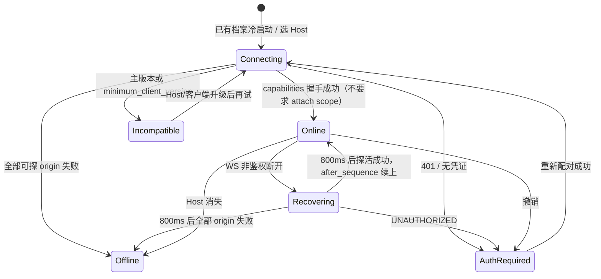
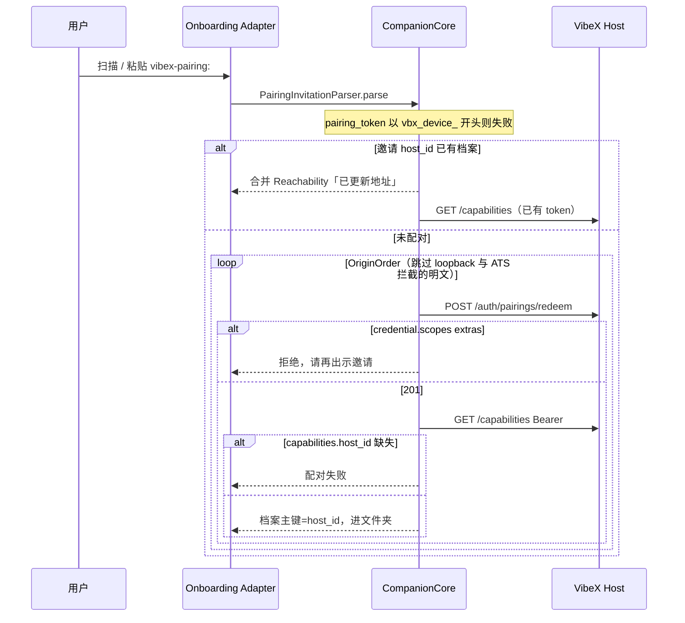
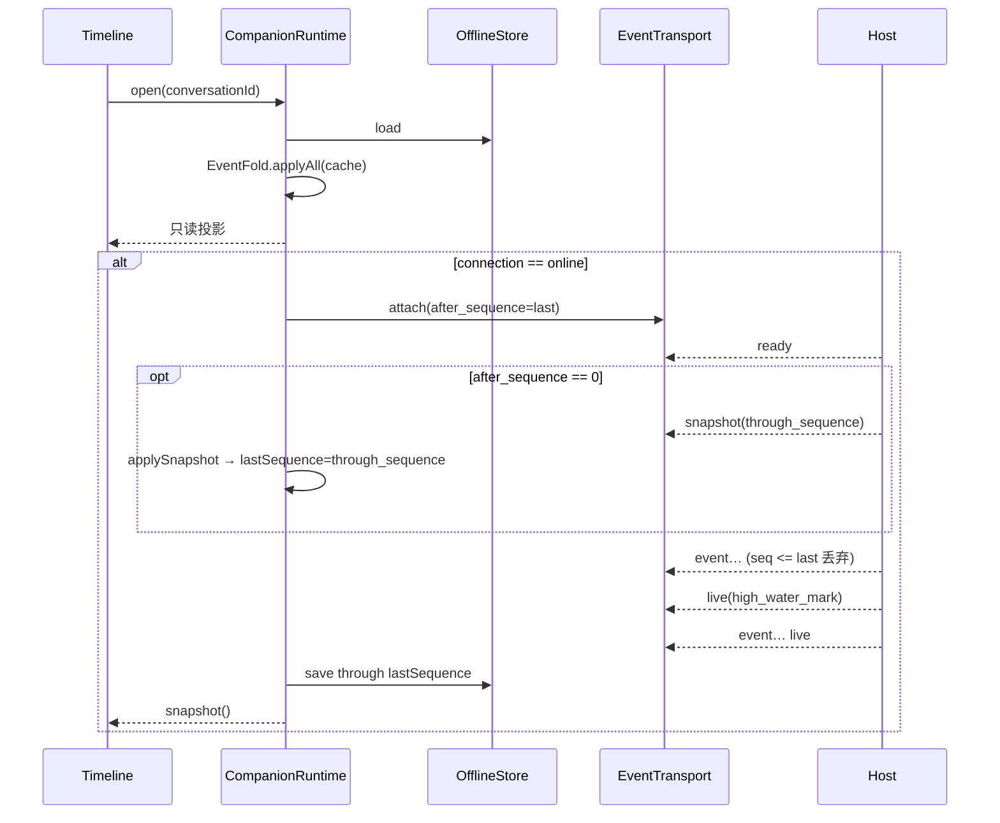
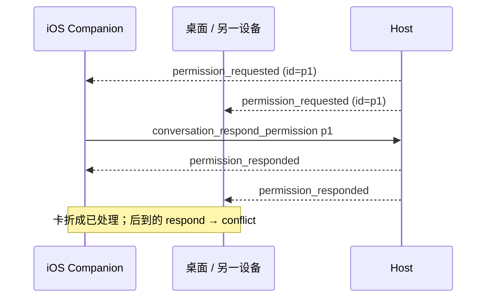
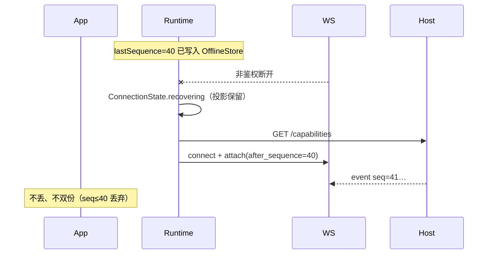

# VibeX-IOS 薄客户端完整实现方案

| 项 | 值 |
| --- | --- |
| 文档 | VibeX iOS Companion 实现设计 |
| 作者 | TBD |
| 日期 | 2026-09-12 |
| 状态 | Draft |
| 产品权威 | [`PRD/`](../../PRD/README.md) |
| 视觉权威 | [`DESIGN.md`](../../DESIGN.md)、[`impeccable/`](../../impeccable/README.md) |
| 协议权威 | VibeX `docs/protocol/v1/`（OpenAPI + JSON Schema）；本仓只存生成 Swift 快照 |
| 行为对照 | `vibex-remote-android` 的 `:companion-core`（`HostApi`、`PairingClient`、`EventFold`、`CompanionScopes`） |

本文给将要实现本应用的资深工程师。读完应能从 M0 做到 M6，不必再从协议或 Android 源码反推信息架构。冲突时优先级：本仓 `PRD/` → VibeX `docs/protocol/v1/` 与 ADR-0054 / 0059 / 0044 / 0001 / 0058 → Android 仓行为 → `impeccable/` 视觉。

---

## Overview

VibeX-IOS 是 Host 家族的 **Companion Device**：纯原生 Swift / SwiftUI 薄客户端。Agent、Worktree、终端、插件、Git 永远跑在用户控制的 VibeX Host 上。手机配对桌上的 Host，折叠事件日志，发送跟进，批准卡住的权限，并在断网后只读已缓存时间线。它不是缩小版桌面，不是 Codeg 远程控制台，也不是 Android Compose 的像素移植。

实现上把协议与领域规则收进一个可测试的深 Module **CompanionCore**（配对解析/兑换、origin 试探顺序、scopes 校验、事件折叠、命令编码），UI 只做浅 Adapter。传输是 Seam（`HTTPTransport` / `EventTransport`），URLSession 是 Implementation，内存假对象供单测。视觉走 codeg-ios 同源的 Liquid Glass（SF Pro、默认 Neutral accent、双晕底、系统 `TabView`），信息架构是四栏：文件夹 / 会话 / 状态 / 设置。

---

## Background & Motivation

Android Companion 已交付同一产品闭环。iOS 仓目前只有 `PRD/`、`PRODUCT.md`、`DESIGN.md`、`impeccable/`，**没有 Swift 源码**。若直接在 Feature 里手写 URL、scope 和事件 `switch`，会得到第二份协议、无法与 Android golden fixture 对齐，并在未知 `RemoteEvent.kind` 上崩溃。

痛点：

1. Remote Protocol v1 已有生成 Swift（`docs/protocol/v1/generated/swift/RemoteProtocolModels.swift`），但没有客户端折叠、配对、连接态。
2. Android 把可测规则放在 `:companion-core`，UI 在 `:app`。iOS 必须有对等 Module，否则折叠逻辑会散落在 SwiftUI。
3. codeg-ios 的 Git / MCP / PTY / 五栏搜索是**反参考**。只借 DesignSystem 材料与模块切分。
4. 凭证、WS 鉴权、loopback、离线写队列是安全边界，不能在页面层「先做出来再修」。

---

## Goals & Non-Goals

### Goals

- 扫或粘贴 `vibex-pairing:` 邀请完成 Companion 配对；同一 `host_id` 合并 Reachability，不建第二档案。
- 连接态六态可见；**只有 `online` 可写**。
- 选项目 → 近 3/7/30 天会话 → 时间线跟随在途回合 → 批权限 / 答提问。
- 一条 WebSocket、按 conversation 订阅；`after_sequence` 续传，sequence 去重。
- 未知 event kind 保留 JSON，缓存仍可读；`turn_interrupted` 永不自动重发。
- iPhone `TabView` 四栏；iPad `NavigationSplitView`；凭证进 Keychain。
- CompanionCore 单测覆盖配对、origin 排序、scopes、折叠。配对/origin/scopes **移植** Android Kotlin 断言（不共享文件）。EventFold 使用本仓 `docs/fixtures/companion-core/*.json`（PR 8 从 Android 测试抽出 + PRD 未知 kind 金样）。

### Non-Goals

- Git 写、终端 PTY、插件写、MCP、Host 监听 / FRP / token、Workflow / Automation 写、`application.call`。
- 第五个搜索 Tab、自制胶囊底栏、IBM Plex 作 UI 脸、把 Android `LiquidNavBar` 画进 `safeAreaInset`。
- Kotlin Multiplatform UI 或 KMP 共享运行时（ADR-0041）。P1 也不把 CompanionCore 做成 KMP。
- APNs / FCM、云中继、账号系统、分析 SDK。
- 离线排队写、「稍后发送」、跨设备 Composer 草稿。
- 在手机上跑 Agent 或把本应用变成 Host。
- 手写第二份协议 schema，或改生成的 Swift 模型。

---

## Key Decisions

| 决策 | 选择 | 理由 |
| --- | --- | --- |
| 协议权威 | 快照 VibeX `docs/protocol/v1/generated/swift`，禁止手改 | ADR-0041 / PRD-04；生成文件是编译夹具 |
| 领域 Module | 原生 Swift **CompanionCore** 静态库，UI 不拥有配对/折叠/命令 | 对标 Android `:companion-core`；Depth 在 Interface 后面 |
| 传输 Seam | `HTTPTransport` + `EventTransport`；URLSession Adapter + 内存 fake | 单测不碰网络；Host 可替换 |
| 一条 WS | 每 Host 一条 socket，多 `attach` 订阅 | 协议「一条 Socket，多个订阅」；不要每会话一条 |
| 持久化 | Profile / 离线事件用 Application Support JSON；凭证 Keychain | 无 SwiftData 迁移成本；秘密与元数据分离 |
| 工程 | XcodeGen `project.yml` 权威；不手改 pbxproj | PRD-05 已锁 |
| 状态 | `@Observable` + Swift 6 严格并发；禁止 ObservableObject 三件套 | iOS 26 / PRD-05 |
| 写门闩 | `ConnectionState.allowsWrites == (self == .online)`。`online` = capabilities 握手成功（origin 可达、主版本匹配、凭证有效）。**不**要求 `conversation.attach` | HTTP 写走 `/call`；缺 attach 只禁止 live WS，不禁止 submit/审批 |
| Origin 顺序 | 上次成功 → `https://` → kind ∈ {published, relay, existing} → 其余；永不 loopback | 与 `OriginOrder.kt` 一致 |
| ATS 明文 | 非局域网 `http://`（非 RFC1918 / link-local / `.local`）不探活，记 `triedOrigins.outcome = ats_blocked` | iOS 仅 `NSAllowsLocalNetworking`；避免把 ATS 失败说成 Host 宕机。与 Android 故意分叉 |
| 档案主键 | 成功 `GET /capabilities` 后的 `ServerCapabilities.host_id`。邀请 `host_id` 只用于「兑换前合并」短路。缺 `host_id` 则配对失败，禁止 `host:${origin}` | ADR-0059；避免手动配对后再扫邀请裂成两档 |
| 配对合并 | 本地已有该 `host_id` 档案则只合并 Reachability，不 redeem | ADR-0059 |
| Scope | **仅**兑换后的 `DeviceCredential.scopes` 跑 `CompanionScopes.extras`；非空则失败。邀请 JSON 的 `requested_scopes` 可记日志，不阻塞解析 | 邀请 payload 常无 scopes；Android 也只在 redeem 后检查 |
| 纠偏 | `conversation_steer` + `expected_turn_id`；失败不降级为排队。UI：在途时 Composer **主按钮仍为排队**，旁路 **「纠偏」pill**（仅 `canSteer`）；M3 用此形态，不用分段「纠偏 \| 排队」 | ADR-0044；已决 Open Question 4 |
| 显示名 | `CFBundleDisplayName` = **VibeX**。Bundle ID `dev.vibex.companion` | 已决 Open Question 2；与 Android 通知标题一致 |
| 分发 | 测试阶段 **仅开发者证书侧载**（GitHub Releases）。不上架；不要求 TestFlight。不阻塞 M0–M5 模拟器 | 已决 Open Question 1 |
| 中断 | `turn_interrupted` 只展示手点重试（新 Turn） | ADR-0001 |
| `operation_id` | `CompanionRuntime` 对每次用户意图生成一次 UUID，重试复用；`HostClient` 方法必须接受 `operationId`，禁止在 HTTP 辅助函数内 `UUID()` | 协议幂等；Android `HostApi.call` 每次新建 id 是缺陷，不移植 |
| Inbox | `listRecent` 之后对前 **N=8** 条 `GET …/offline` 折叠，`pendingItems` 求并；P1 不对这些会话 WS-attach | 否则待办条在未打开过的会话上为空 |
| JSON | 生成模型用其 snake_case Codable。catalog / fold / 开放 JSON 用 `JSONValue` 访问器（camel **与** snake）。不为 catalog 另写 Codable struct | 对标 `JsonExt.kt` + `HostApi.catalog` |
| WS 实现 | **必须** `urlSession.webSocketTask(with: url, protocols: ["vibex.v1", "vibex.token.<b64url>"])`，禁止把该头写在 `URLRequest` 上。URL = `HostOrigin.resolve("/api/v1/ws")` 再 `http→ws` / `https→wss`。Token base64url **无 padding**。若 URLSession 无法同时 offer 未选中的 `vibex.token.*` 与选中的 `vibex.v1`，M3 前改用 `NWConnection` HTTP 升级写原始头，不引入第三方 WS 库 | Host `ws.rs` `.protocols(["vibex.v1"])` + `ws_token_from_protocols`；URLSession 常丢 `URLRequest` 上的该头 |
| Fold 补丁 | `applySnapshot` 顺序：id/title → 填 `rows[]` 或折内嵌 `events[]` → **最后** `lastSequence = through_sequence`。禁止先写 lastSequence 再 `apply` events（会被门闩丢光）。`apply` 只按 `sequence <= lastSequence` 丢弃。`revision` 仅 UI 身份 | 否则 snapshot+replay 双份气泡，或 events[] 快照空时间线 |
| 无工作区 | 隐藏，直到 catalog 显式 `workspaceLessAvailable` | 与 Android 已决一致 |
| 监控 | 用户开关；打开时才请求通知权限；前台保持 WS，后台仅 `BGAppRefreshTask`（约 15min）轮询 `notification-summary`；无 APNs。文案**不得**写「持续在线」 | P1；已决 Open Question 3 |
| 视觉 | Neutral 默认 accent；系统 TabView 四栏；SF Pro | `DESIGN.md` / `impeccable/` |
| WS 鉴权 | Offer `vibex.v1, vibex.token.<base64url>`；token 永不进 URL | Host `ws.rs` + `runtime.rs` 的现网握手 |
| 恢复 | Recovering 等待 **800ms** 后走完整 origin 探活（同 Android `bindSocket`）。无次数上限。探活全失败 → `offline`，不是「重试耗尽」计数器 | 与 Android P1 对齐 |

---

## Host 能力接入面

本节是 iOS 消费的**完整** Remote Protocol v1 面。不发明第二协议。命令名、路径、WS 帧与 Android `HostApi.kt` / `EventSocket.kt` / `PairingClient.kt` 对齐。缺 scope 或 capability 时 **fail-closed**：隐藏并禁用对应入口，命令层拒绝发送，Host 403/capability_unavailable 视为预期而非重试成功。

### 1. Companion Device scopes（配对 allowlist）

来源：ADR-0054、`CompanionScopes.kt`、`PRD/04-protocol-and-events.md`。**兑换结果** `DeviceCredential.scopes` 带任何额外 scope → 拒绝配对，文案「请在电脑上再出示邀请」。邀请 JSON 若含 `requested_scopes` extras，只记日志，**不**阻塞解析（Host 邀请常省略该字段）。

| Scope | 本应用用途 | 缺失时 |
| --- | --- | --- |
| `conversation.read` | catalog、近 N 天列表、slash、工作区条目、时间线只读、文件夹 | 无法进入主壳写路径；显示不兼容/无目录 |
| `conversation.write` | 新建会话/工作区、submit、改名、置顶、归档、删除、四态、session mode/config | 隐藏 FAB 与写菜单 |
| `conversation.attach` | WS `attach` conversation | 不连 EventTransport / 无 live；**仍可** `online` 并用 HTTP 写（`allowsWrites` 不依赖本 scope）。时间线靠 `offline.read` 刷新 |
| `conversation.permission` | `conversation_respond_permission` | 权限卡只读，无允许/拒绝 |
| `conversation.question` | `conversation_respond_question` | 提问卡只读 |
| `conversation.cancel` | 取消在途 Turn、取消未认领输入 | 隐藏取消 |
| `conversation.steer` | `conversation_steer` | 纠偏入口隐藏；在途发送走排队 |
| `artifact.read` | `artifact_list`、文件变更点开 | 只显示摘要文案，不拉产物 |
| `workflow.read` | 协议允许 `attach workflow_run` | P1 不展示运行编辑器；**attach 不得因产品面未做而失败** |
| `automation.read` | 只读出现在 capabilities 页 | 无写入口 |
| `delegation.read` | 子会话卡可点开 | 卡不可导航 |
| `notification.summary` | `GET …/notification-summary` | 监控开关禁用并说明 |
| `offline.read` | `GET …/offline` | 离线缓存不可刷新；已有本地文件仍可读 |

**没有、且必须拒绝的 scope 示例：** `plugin.write`、`workflow.write`、`automation.write`、`application.call`、Git 写、终端、Host 管理、`device.revoke`（管理他人）。忘记本设备走 `DELETE /api/v1/auth/devices/{自己的 device_id}`，不加管理 scope。

`CompanionScopes.extras(scopes)` 与 Android 相同：

```swift
public enum CompanionScopes {
    public static let allowed: Set<String> = [
        "conversation.read", "conversation.write", "conversation.attach",
        "conversation.permission", "conversation.question",
        "conversation.cancel", "conversation.steer",
        "artifact.read", "workflow.read", "automation.read",
        "delegation.read", "notification.summary", "offline.read",
    ]
    public static func extras(_ scopes: some Collection<String>) -> Set<String> {
        Set(scopes).subtracting(allowed)
    }
}
```

### 2. HTTP 路径（v1）

权威：VibeX `docs/protocol/v1/openapi.json`。Base 为 origin + `/api/v1`，**origin 不含 credentials / query / fragment**（`HostOrigin.parse`）。

| Method | Path | 鉴权 | 用途 | 需要的 scope / 条件 |
| --- | --- | --- | --- | --- |
| `GET` | `{origin}/health` | 无 | **仅** origin 探活，不代替 capabilities | 无。失败不改变档案身份 |
| `GET` | `/api/v1/capabilities` | Bearer | 握手：`protocol_version`、`minimum_client_version`、`host_id`、`capabilities[]`、Reachability | 已配对。主版本 ≠ 1 → `incompatible` |
| `POST` | `/api/v1/auth/pairings/redeem` | 无 | 一次性兑换 | 未持有该 `host_id` 时才调用 |
| `DELETE` | `/api/v1/auth/devices/{device_id}` | Bearer | 忘记时撤销**本**设备 | 可达才调用；失败仍清本地 |
| `POST` | `/api/v1/call/{command}` | Bearer | 全部应用命令 | 见下表；body 为 `CommandRequest` |
| `GET` | `/api/v1/conversations/{id}/offline?after_sequence=` | Bearer | 只读事件；`read_only` 必须当 true | `offline.read` |
| `GET` | `/api/v1/conversations/{id}/notification-summary` | Bearer | 终态摘要，无 prompt/路径 | `notification.summary` |
| `GET` | `/api/v1/ws` | `Sec-WebSocket-Protocol` | 订阅枢纽 | `conversation.attach` |

HTTP 头：

- `Authorization: Bearer <access_token>`（除 redeem、health）
- `x-vibex-protocol-version: 1.0`（与 `PairingClient.CLIENT_PROTOCOL_VERSION` 相同）
- `Content-Type: application/json`（有 body 时）

**禁止：** token 进 query、fragment、WS URL、日志。401 → `auth_required` 并断开已有 WS。

### 3. `POST /api/v1/call/{command}` — HostApi 对照表

请求：`{ "operation_id": "<uuid>", "args": { … } }`。同一用户意图的重试必须带**同一个** `operation_id`，不得产生第二条输入。`operation_id` 由 `CompanionRuntime` 生成并在重试中复用；`HostClient` 经参数传入，禁止在 HTTP 层 `UUID()`。响应取 `data`。错误为 `ErrorEnvelope`（`bad_request` / `unauthorized` / `forbidden` / `not_found` / `conflict` / `capability_unavailable` / `internal`）。

上表是 `HostClient` 的**封闭命令集**。P1 不增加 Git / MCP / PTY / plugin / workflow 写 / Host 管理方法。按 PR 分批实现，但不得在 Interface 里写「其余与 HostApi 一一对应」的省略号。

| HostClient 方法 | command | args（camelCase，Host 亦接受 snake） | 随后可见 | scope | 缺能力 |
| --- | --- | --- | --- | --- | --- |
| `catalog` | `conversation_catalog` | `{}` | 只读目录 | `conversation.read` | 文件夹/新会话不可用 |
| `listRecent` | `conversation_list_recent` | `limit`, `sinceDays`, `projectId?` | 会话列表 | `conversation.read` | 列表空+错误 |
| `listForWorkspace` | `conversation_list` | `workspaceId` | 备用列表 | `conversation.read` | 隐藏 |
| `listSlashCommands` | `conversation_slash_commands` | `agentId`, `workspaceId?` | `/` 候选 | `conversation.read` | 候选为空，不编造 |
| `listWorkspaceEntries` | `conversation_workspace_entries` | `workspaceId` | `@` 文件 | `conversation.read` | `@` 为空 |
| `createWorkspace` | `conversation_workspace_create` | `projectId`, `name`, `branch?` | 目录更新 | `conversation.write` | 隐藏「新建工作区」 |
| `createConversation` | `conversation_create` | `workspaceId`, `agentId`, `title?`, `initialPrompt?` | `conversation_created` | `conversation.write` | FAB 禁用 |
| `submitInput` | `conversation_input_submit` | `request: { conversationId, payload: { agentId, workspaceId, text } }` | `conversation_input` | `conversation.write` | Composer 不可提交 |
| `cancelConversationInput` | `conversation_input_cancel` | `request: { conversationId, inputId, expectedRevision }` | 输入 Cancelled | `conversation.cancel` | 隐藏取消排队 |
| `steer` | `conversation_steer` | `request: { conversationId, expectedTurnId, text }` | `conversation_steering` 或 conflict | `conversation.steer` | 纠偏隐藏；**不得**改成 submit |
| `cancelTurn` | `conversation_cancel_turn` | `request: { conversationId }` | `turn_cancelled` | `conversation.cancel` | 隐藏 Stop |
| `respondPermission` | `conversation_respond_permission` | `request: { conversationId, permissionId, response: { kind: "selected", option_id } }` | `permission_responded` | `conversation.permission` | 卡只读 |
| `respondQuestion` | `conversation_respond_question` | `request: { conversationId, questionId, response: { action: "accept", content: { text } } }` | `question_responded` | `conversation.question` | 卡只读 |
| `archiveConversation` | `conversation_archive` | `conversationId` | 列表更新 | `conversation.write` | 隐藏 |
| `setPinned` | `conversation_set_pinned` | `conversationId`, `pinned` | 列表 | `conversation.write` | 隐藏 |
| `deleteConversation` | `conversation_delete` | `conversationId` | 列表 | `conversation.write` | 隐藏 |
| `renameConversation` | `conversation_rename` | `conversationId`, `title` | 列表/标题 | `conversation.write` | 隐藏 |
| `setStatus` | `conversation_set_status` | `conversationId`, `status`（`todo`/`inprogress`/`inreview`/`done`） | 状态页 | `conversation.write` | 四态只读 |
| `setSessionMode` | `conversation_set_session_mode` | `conversationId`, `modeId` | `session_mode_updated` | `conversation.write` | 信息 sheet 只读 |
| `setSessionConfigOption` | `conversation_set_session_config_option` | `conversationId`, `key`, `value` | `session_config_options_updated` | `conversation.write` | 只读 |
| `listArtifacts` | `artifact_list` | `conversationId`, `limit` | 只读路径 | `artifact.read` | 不请求 |

P1 **不调用** Git、MCP、PTY、plugin、workflow 写、Host 管理命令。收到未知 command 名称不得本地发明。

Catalog 解析必须同时接受 camelCase 与 snake_case（`projectId`/`project_id`），与 `HostApi.catalog` 测试一致。Agent `usable`：`ready == true` 且 lifecycle 为空或 `ready`，且 authentication 不是 `not_logged_in` / `multiple_unknown`（`agentIsUsable`）。

`workspaceLessAvailable`（或等价字段）缺省为 false：新会话 sheet **不**展示无工作区项。

### 4. WebSocket 消息

握手 URL：**先** `let http = origin.resolve("/api/v1/ws")`（保留 `HostOrigin` 的 host/port/**path 前缀**），再把 scheme `http→ws`、`https→wss`。禁止手写 `ws://{host}/api/v1/ws`（会丢 path 与 port）。URL **无** query、**无** token。

Token：UTF-8 字节 → base64url **无 padding**（`URL_SAFE_NO_PAD`）。

Adapter **必须**调用：

```swift
urlSession.webSocketTask(
    with: wsURL,
    protocols: ["vibex.v1", "vibex.token.\(encoded)"]
)
```

禁止在 `URLRequest` 上设置 `Sec-WebSocket-Protocol`（URLSession 常剥掉该头）。Host 选择子协议 `vibex.v1`，并从 offer 里的 `vibex.token.` 解码凭证（`ws_token_from_protocols`）。PR 8 抓升级请求：两个 protocol token 都在，URL 无 query。

若该 API 仍无法把未选中的 `vibex.token.*` 与选中的 `vibex.v1` 一起 offer，**在 M3 合入前**改 `NWConnection` HTTP/1.1 升级并写原始头。不引入 Starscream 等第三方库。见 Alternatives §5。

生成的 `SubscriptionClientMessage` / `SubscriptionServerMessage` 是 `JSONValue` 别名，**不要**拿去 `JSONDecoder` 当 attach 字段。CompanionCore 使用 overlay 枚举 `ClientFrame` / `ServerFrame`（见 API）。未知 server `type` → `.unknown`，不断开。

**客户端 → 服务端（`ClientFrame`，编码为 JSON）**

| type | 字段 | 规则 |
| --- | --- | --- |
| `attach` | `request.subscription_id`, `resource`, 资源键, `after_sequence` | `resource=conversation` 时要 `conversation_id`；P1 产品只 attach conversation，但解码必须接受 `workflow_run` / `host_event` / `patch_stream` 以免协议失败 |
| `detach` | `subscription_id` | 离开时间线或会话删除 |
| `ping` | — | 20s 一次（Android `EventSocket` 同） |

**服务端 → 客户端（`ServerFrame`）**

| type | 含义 | 客户端 |
| --- | --- | --- |
| `ready` | 订阅已登记 | 消除「命令已发、尚未订阅」竞态 |
| `snapshot` | `through_sequence` + 投影 payload | `EventFold.applySnapshot`（顺序与 §5 相同，禁止提前写 lastSequence）：写入 id/title → 填 `rows[]` **或** 用 `apply` 折内嵌 `events[]` → **最后** `lastSequence = through_sequence`。Host 在 `after_sequence=0` 时可能带 snapshot |
| `event` | `RemoteEvent { sequence, kind, payload }` | `sequence <= lastSequence` 则丢弃；否则 fold。无第二套 revision 门闩 |
| `live` | `high_water_mark` | 进入实时；可把高水位写入 checkpoint |
| `detached` | `reason` | 结束该订阅 |
| `error` | `ErrorEnvelope`；`UNAUTHORIZED` | 立刻 `auth_required`、关 socket |
| `pong` | ping 应答 | 忽略 |

顺序：`ready` → 可选 `snapshot` → replay `event…`（sequence > after_sequence）→ `live` → 实时 `event…`。

`after_sequence`：本地已确认的最大 sequence。无缓存时为 0。

也可 attach `workflow_run`（只读）。P1 UI 不展示运行编辑器，但 **不得** 因产品面未做而让协议层失败（忽略未知 server 帧 type，不断开）。

### 5. `RemoteEvent.kind` 折叠与 fail-closed

`kind` 是开放字符串。未知 kind：**保留原始 JSON 进离线缓存**，时间线占位「Host 更新了此会话」，应用不崩。这比当前 Android `EventFold`「无可见文本则静默」更严，以本仓 PRD 为准。

| kind | 时间线 / 状态 | 写副作用 |
| --- | --- | --- |
| `conversation_created` | 不成行；更新标题 | — |
| `conversation_input` | 队列条：已提交 / 已更新 / 已认领 / 已取消 | 未认领可改可删 |
| `conversation_steering` | 纠偏条，挂目标 Turn | — |
| `conversation_relation_created` | 子会话卡 | 无 `delegation.read` 则不可点 |
| `agent_binding_started` | 「正在启动 Agent」 | — |
| `agent_binding_ready` | 去掉启动态 | 能力快照可显隐 steer |
| `agent_binding_recovered` | 短恢复提示 | — |
| `agent_binding_recovery_failed` / `agent_binding_load_failed` | 错误条 | 后者可有重绑入口若 Host 给 |
| `agent_connection_status_changed` | **顶栏**，不成行 | — |
| `user_turn_created` | 用户气泡 | 去掉同文案 `local:` 行 |
| `user_turn_queued` | 「已排队」 | — |
| `user_turn_started` | 去掉排队，进入在途 | — |
| `assistant_text_delta` | 按 `message_id` 合并助手行 | — |
| `assistant_reasoning_delta` | 思考块；默认按设置折叠/隐藏 | 不当正文 |
| `assistant_content_appended` | 按块类型；未知块保留 | — |
| `plan_updated` | 计划列表；用协议 `status`/`priority` | **禁止**一律写成 pending；禁止从自由文本猜 |
| `tool_call_upsert` | 按 tool id upsert | 只读；无 Git 提交 |
| `permission_requested` | 待办 + 时间线卡 | 无 `conversation.permission` 则无按钮 |
| `permission_responded` | 卡已处理；任意设备互斥 | — |
| `question_requested` / `question_responded` | 待办 + 选项 | 无 question scope 则无作答 |
| `feedback_requested` / `feedback_submitted` | 进待办 | — |
| `terminal_updated` | 只读摘要 | **无 PTY** |
| `usage_updated` | 仅字段存在时显示 | **禁止填 0** |
| `file_change_summary_updated` | 「N 个文件」只读 | 无提交/推送 |
| `artifact_revision_recorded` | 只读产物 | 无 `artifact.read` 不拉字节 |
| `turn_blocked` | 待办角标 | — |
| `turn_completed` / `turn_failed` / `turn_cancelled` | 结束条（completed 可不另插卡） | — |
| `turn_interrupted` | 已中断 + 手点重试 | **禁止自动重发** |
| `session_mode_updated` / `session_config_options_updated` | Composer / 信息 sheet | 缺失不填默认假装已应用 |
| `session_config_stale` | 通知「默认未生效」 | — |
| `prompt_capabilities_updated` | `canSteer`、附图 | `steer != true` 则无纠偏 |
| `available_commands_updated` | `/` 候选；无则空 | 不本地编造 Host 命令（内置 compact 等见 SlashCommands，且须可被 Host 列表覆盖） |
| `agent_session_info_updated` | 只回填 Agent 给出的 title | 不本地猜标题 |
| `delegation_started` / `delegation_completed` | 子会话卡 + 结果 | — |
| `raw_diagnostic_recorded` | 默认隐藏 | 无 secret |
| 其它未知 | 占位「Host 更新了此会话」 | payload 进缓存 |

静默（不成行）但必须消费：`available_commands_updated`（更新候选）、`agent_connection_status_changed`（顶栏）、`user_turn_started`、`turn_completed`（清 in-flight）、`conversation_created`、`agent_binding_ready`。

Snapshot 最低字段：`conversation_id`、`title`、`through_sequence`、当前 Turn、timeline rows **或** 内嵌 events、未认领 inputs、未处理 permission/question、agent 连接状态、capabilities 快照。

**唯一补丁规则（锁死，禁止第二套 revision 门闩）：**

1. `applySnapshot(session, snapshot)` 顺序锁死：
   1. 写入 `conversationId` / `title`；
   2. 有 `rows[]` 则直接填行（不走 sequence 门闩）；**否则**对内嵌 `events[]` 调用 `apply` / `applyAll`（此时 `lastSequence` 仍是进入前的值，通常 0，事件不会被丢）；
   3. **最后** `session.lastSequence = snapshot.through_sequence`（缺则用内嵌 events 的最大 sequence，再缺则为 0）。
2. `apply(session, event)`：若 `event.sequence <= session.lastSequence` 则 return；否则 `lastSequence = event.sequence` 并 fold。
3. `TimelineRow.revision` 等于产生该行的 sequence，**只**给 SwiftUI `id` / 调试用，**不**参与是否应用事件。

禁止把步骤 1.3 提前到 1.2 之前：若先写 `lastSequence = through_sequence` 再 `apply` 内嵌 events，全部 `sequence <= lastSequence`，时间线被丢空。WS §4 表不得写成另一种顺序。

首开 `after_sequence = 0` 时 Host 可能同时给 snapshot **和** replay `seq 1…through`。没有步骤 1.3，replay 会叠在 snapshot 行上，双份气泡（验收 11、16 失败）。Android `applySnapshot` 在 `rows[]` 路径不推进 `lastSequence`，**这是缺陷，iOS 不移植**。

Core 金样：

- `docs/fixtures/companion-core/fold-snapshot-replay.json`：snapshot `through_sequence=3` 带一条助手 **rows[]** + replay seq 1…3 的 `assistant_text_delta` → **一行**合并正文、`lastSequence=3`；再 live seq 4 才追加。
- `docs/fixtures/companion-core/fold-snapshot-events.json`：snapshot **只有** `events[]` seq 1…3、无 `rows[]`，`through_sequence=3` → 折出对应行、`lastSequence=3`（证明 fill 发生在赋值 lastSequence 之前）。

### 6. Capabilities 协商

`GET /api/v1/capabilities` 之后：

1. `protocol_version` 主版本必须为 `1`，否则 `incompatible`。
2. 若 Host 的 `minimum_client_version` 大于本应用短版本，`incompatible`。
3. **档案主键 = `capabilities.host_id`。** 缺该字段 → 配对失败（不发明 `host:${origin}`）。邀请里的 `host_id` 只用于兑换前「已有档案则合并、不 redeem」。凭证写入 Keychain 的 account 也是该值。若邀请 `host_id` 与 capabilities 不一致，以 capabilities 为准。
4. `reachability[]` 合并进档案（仍丢弃 loopback；再丢弃 ATS 会拒绝的公网明文 HTTP，见 Origin 节）。
5. `capabilities[]` 为开放字符串（Host 功能协商），**不是** Companion Device scopes。未知项保留并在设置「能力」页列出。缺某写 **scope**（凭证里的）→ 对应方法拒绝发送。缺某 **capability** 字符串 → 抛 `capability_unavailable` 等价，UI 禁用。
6. 缺 `conversation.attach` scope：不建立 EventTransport；`ConnectionState` 仍可为 `online`；HTTP `/call` 写仍允许。

Companion 可以落后 Host **一个次版本**。主版本不兼容禁止写。

### 7. Catalog 形状（`conversation.read`）

必须能拿到：

- Project：`id`, `name`, `path`
- Workspace：`id`, `projectId`, `name`, `branch`
- Agent：`id`, `displayName`, `ready`, `usable`, `lifecycle`, `authentication`, `iconSvg`, `currentModeId`, `sessionConfig`, `sessionModes`
- Tag（`#` 指令）：`id`, `name`, `content`；无则空
- 可选 `workspaceLessAvailable: Bool`

这是会话读模型，不是运维面。未就绪 Agent 标明原因、不可选。

---

## Proposed Design

### 深 Module 结构

用词固定：**Module / Interface / Implementation / Depth / Seam / Adapter / Leverage / Locality**。

```text
SwiftUI Features  (shallow Adapter)
        │  只依赖小 Interface
        ▼
┌──────────────────────────────────────────┐
│ CompanionCore          深 Module         │
│  Interface: CompanionRuntimeProtocol     │
│  Depth: 配对、origin、scopes、fold、     │
│         命令编码、连接态、composer token │
│  Seam: HTTPTransport, EventTransport     │
└───────────────┬──────────────────────────┘
                │ Adapter
     ┌──────────┴──────────┐
     ▼                     ▼
 URLSessionHTTP         URLSessionEvent
 ScriptedHTTP (tests)   FakeEvent (tests)
```

- **Locality：** 协议规则只住在 CompanionCore。Feature 不得 `switch` event kind，不得拼 `/api/v1/call/`。
- **Leverage：** 一份 `EventFold` 同时服务时间线、待办 inbox、离线回放、监控摘要触发。
- **Depth：** 调用方只说 `submit` / `steer` / `attach`；幂等 `operation_id`、scope 检查、401 映射藏在 Implementation。
- **Seam：** 传输可替换。UI 与 Keychain 都不进入 CompanionCore 的测试图。

Persistence（Keychain、JSON 文件）是 App 侧 Adapter，通过小 Interface `CredentialStoring` / `ProfileStoring` / `OfflineStoring` 注入，便于单测。它们**不是** CompanionCore 的领域 Depth，只是平台存储。

### 包布局

对标 codeg-ios 的 `App` / `Models` / `Networking` / `Persistence` / `DesignSystem` / `Features`，并加上可测的 CompanionCore：

```text
VibeXCompanion/
  App/                    入口、RootView、AppModel、路由
  CompanionCore/          深 Module（无 SwiftUI）
    CompanionRuntimeProtocol.swift   对外小 Interface
    Protocol/             由 docs/protocol/v1/generated/swift 编入，不手改
    Pairing/
    Connection/
    Host/                 internal HostClient（封闭集 = §3）
    Timeline/             EventFold, 内部 TimelineSession, StreamLayout, ToolBodies
    Composer/             SlashCommands markup
    Scopes/
    Transports/           HTTPTransport, EventTransport, ClientFrame, ServerFrame
  Models/                 App 侧投影（Route、UiSnapshot）；不平行手写协议
  Networking/             URLSession HTTP/WS Adapter
  Persistence/            Keychain CredentialStore, ProfileStore, OfflineStore
  DesignSystem/           Theme, Appearance, Glass, StateViews, CompanionBackground
  Features/
    Onboarding/
    Folders/
    Sessions/
    Timeline/
    Status/
    Settings/
  Resources/
    Localizable.xcstrings   en + zh-Hans
    Assets.xcassets
    Info.plist
VibeXCompanionTests/      CompanionCore 为主；Features 用 fake runtime
docs/protocol/v1/         从 VibeX 钉住的 schema + generated/swift
project.yml
```

XcodeGen 三个 target：`CompanionCore`（static library）、`VibeXCompanion`（app，依赖 Core）、`VibeXCompanionTests`。

### 连接状态机



```swift
public enum ConnectionState: String, Sendable, Equatable {
    case connecting, online, recovering, offline, authRequired, incompatible
    public var allowsWrites: Bool { self == .online }
}
```

非 `online`：发送、纠偏、审批、新建、改四态全部不可用，原因走信号条文案（`impeccable/copy.md`）。`recovering` 保留当前投影，不闪空。WS 非鉴权断开 → `recovering` → **800ms** → 完整 origin 探活（无次数上限）。探活全失败才进 `offline`。不要实现「N 次耗尽」计数器。

试探顺序（`OriginOrder.probeOrder`，与 Android 单测锁定）：

1. 去重（LinkedHash / 保序 Dictionary）
2. 上次成功 origin rank 0
3. `https://` rank 1
4. kind ∈ `published` | `relay` | `existing` rank 2
5. 其余 rank 3
6. 解析时丢弃含 `127.0.0.1` / `localhost` 的 origin（永不试探）
7. **ATS 过滤（iOS 相对 Android 的分叉）：** `http://` 且 host **不是** RFC1918 / link-local / `*.local` → 不加入探活列表，写入 `triedOrigins` 且 `outcome = ats_blocked`。UI 不得显示为「Host 无响应」
8. `HostOrigin` 拒绝 userInfo、query、fragment；无 scheme 时默认 `http://`

`GET /health` 只用于可选探活；**上线判决以 capabilities 为准**。

### 根状态

连接、目录、会话列表、inbox、打开中的 `ConversationView` 的**唯一事实**是 `CompanionRuntimeProtocol.snapshot`（及 `snapshots` 流）。`AppModel` 是浅 Adapter：持有 runtime、路由、外观/监控偏好，把 snapshot 转给 Features。Features **只**依赖 `CompanionRuntimeProtocol`，不 import `HostClient` / `EventFold` / `TimelineSession`。

```swift
@MainActor
@Observable
final class AppModel {
    let runtime: any CompanionRuntimeProtocol
    var route: Route
    var appearance: AppearancePreference
    var accentIndex: Int  // Neutral = 8
    var streamDisplay: StreamDisplayPrefs
    var monitorEnabled: Bool = false
    // 搜索串、ComposerDraft、sheet detent 留在 Feature
    var snapshot: RuntimeSnapshot { runtime.snapshot }
}
```

同一时刻只连一台 Host。

---

## 完整功能设计

产品与 Android Companion **相同**，不是缩小桌面，不是 Codeg console。行为以 `PRD/03-functional.md` 为准。

### 配对

1. 解析 `vibex-pairing:` JSON 或裸 JSON；否则「这不是 VibeX 邀请」。
2. **`pairing_token` 以 `vbx_device_` 开头 → 拒绝**（扫描与手动同一规则）。`parseManual` 另拒空白码。Android `parse` 里对 `vbx_device_` 的空 `if` 是缺陷，不移植。
3. Reachability 丢弃 loopback；可回退 `host_urls[]`（同样丢 loopback）；再应用 ATS 过滤。
4. 邀请 `host_id` 若本地已有档案：合并 origin，文案「已更新地址」，**不** redeem。secret 过期后仍可从新邀请收下地址。
5. 未配对：按 origin 顺序 `POST redeem`（`device_name` 如 `"iPhone Companion"`），对 **credential.scopes** 跑 extras，再 `GET capabilities`。档案主键 = `capabilities.host_id`；该字段缺失则失败并丢弃刚兑的凭证。
6. 兑换中禁止连点二次 redeem。
7. 全部失败：列出 `triedOrigins`（含 `ats_blocked`），主按钮「再扫描邀请」。

Core 测试：手动 redeem + capabilities `host_id=h1`，再扫邀请 `host_id=h1` → **一个**档案，「已更新地址」。

### 可达性与档案

`HostProfile`：`hostId`（= capabilities.host_id）, `name`, `deviceId`, `reachability[]`, `lastSuccessOrigin`, `lastSyncAt`, `selectedProjectId`。秘密只在 Keychain，account = `hostId`。多档案允许；同一 `host_id` 必须合并。切换档案断开当前 WS，加载该档案的项目选择与离线缓存。

断开 ≠ 忘记。忘记：确认框 → 可达则 `DELETE` 本 `device_id` → 删 Keychain 与档案（缓存一并清该 Host）。

### 文件夹

连接后第一屏。Host 历史项目：色点 + 名称 + 路径末段。搜索名或路径。点选记住 `selectedProjectId` 并同步近 3 天会话。长按：查看信息、在此新建会话。下拉刷新 catalog。无 Git 写。

### 会话列表

标题为当前项目名。窗口 3/7/30。分组：置顶 / 今天 / 昨天 / 本周 / 更早。待办条「N 条待你处理」，点进对应会话。FAB 新会话仅 `online`。滑动/菜单：置顶、重命名、归档、删除（写仅 online）。未选项目：「先选择文件夹」。

**Inbox 数据源（P1 锁死）：** `listRecent` 成功后，对结果前 **N=8** 条（有 `offline.read`）`GET …/offline?after_sequence=`（本地已有 through 则用该值），`EventFold.applyAll` 进 runtime 内的 session map，再 `pendingItems` 求并写入 `RuntimeSnapshot.inbox`。项目切换取消进行中的 prefetch。P1 **不**对这些会话做 WS attach。测试：两会话，仅 B 的 offline payload 含 `permission_requested` → inbox count 1，点开 B。

### 新会话

Sheet。catalog：预选项目、工作区或「新建工作区」、无工作区仅当 Host 显式允许、就绪 usable Agent、可选 prompt、Host 给出的 mode/config（缺失不填默认）。`conversation_create` + 客户端 `operation_id`。失败留在 sheet。成功 push 时间线。创建后若用户选了非默认 mode/config，再调 set mode/option（与 Android `createConversation` 一致）。

### 时间线与 Composer

全屏，隐藏 Tab。系统边缘返回保留。

- 行：用户气泡、助手 Markdown、思考、工具卡、计划、子会话、队列/纠偏、权限、提问、文件变更、Artifact、终端摘要、恢复/错误、未知占位。
- 轨：Live=accent，Hold=warning，Quiet=tertiary，Stop=danger。
- **Submit 总是先持久化。** 空闲 → Turn；在途 → 排队。
- **纠偏是独立动作**：在途且 `canSteer` 时，Composer **主按钮仍为排队**；旁路出现 **「纠偏」pill**（不是分段「纠偏 \| 排队」）。pill 调用 `conversation_steer` + `expected_turn_id`；conflict 报错，不变成排队。无 `canSteer` 则不显示 pill。
- 取消只对在途 Turn；未认领输入可取消。
- Token：`/` `@` `#` `&` `$`，候选来自 Host；无则空。提交前 `serializeComposerBackendMessage`。Markup 与 Android `SlashCommands.kt` **逐字相同**（见 CompanionCore/Composer API）。
- 流式：仅当用户在底部附近自动跟随；否则「↓ 新消息」pill。
- 中断：手点重试发送**新** Turn（默认文案「继续」，用户可改）。不是重放中断 Turn。
- 用量/计划/标题：只显示 Host/Agent 字段。
- P1 不做跨设备草稿；未提交 draft 仅内存，杀进程可丢。

`StreamLayout`（Core）：思考隐藏、失败工具过滤、连续 ≥3 个已完成工具折成「执行了 N 个操作」、在途 Waiting 节点。UI 只渲染 `StreamNode`。

### 权限、提问、状态

权限/提问：卡片内直接映射 Host options；同时进 inbox。两台设备同时批：先到生效，后到 `conflict` / already resolved，本地卡折成已处理。

状态页：Kanban 四态 `todo` / `inprogress` / `inreview` / `done`，竖向可折叠四栏。不是 codeg-ios 活动页。待审批在时间线卡 + 会话待办条。

### 设置

顺序固定：连接 / 外观 / 消息流控制 / Host / 能力 / 关于。无 Agent 安装、MCP、Git、监听。外观默认跟随系统，accent 默认 Neutral（index 8）。持续监控默认关。

### 离线

缓存：本地文件 `{conversationId}.json` 可用 `through` 作 `confirmed_through` 的别名。打开会话先渲染缓存并标只读；online 后再 attach。禁止「稍后发送」。清除缓存不删档案与 Keychain。

Host `GET /offline` **按生成模型**解码：`conversation_id`、`confirmed_through`、`read_only`、`events`。若 `read_only == false`（或缺失当 true）：**仍然拒绝写**，打一条日志，P1 不把缓存当可写队列。

### 监控（P1）

默认关。用户在连接设置打开开关时：

1. 若尚未授权，调用 `UNUserNotificationCenter.requestAuthorization`。拒绝 → 开关保持关，说明用 `impeccable/copy.md` 语气（原因 + 下一步，不道歉）。
2. `App` `didFinishLaunching` **始终** `BGTaskScheduler.shared.register(forTaskWithIdentifier: "dev.vibex.companion.monitor-refresh")`（没注册则系统永不调度）。
3. 授权且开关开：**前台保持 WS**；后台只调度 `BGAppRefreshTask`（系统最早约 15min）轮询最近列表的 `notification-summary`，发**本地** `UNNotification`：标题级 + 终态，无 prompt、输出、路径。设置开关文案用「持续监控」，**不得**写「持续在线」。
4. Scene 进后台可关 socket、保留投影；回前台 `after_sequence` 续传。关掉监控即停后台尝试。不接 APNs。

---

## 页面设计

所有已配对屏：`CompanionBackground` + 顶栏 **连接 chip**。水平边距 16pt。文案 `impeccable/copy.md`。行为 `PRD/03-functional.md`。组件名可加 `Vibex` 前缀，结构对齐 codeg-ios `DesignSystem/`。

| 屏 | Recipe（`impeccable/screens.md`） | 主要组件 | Compact | Regular (iPad) |
| --- | --- | --- | --- | --- |
| 开屏 | 0.8s `Theme.bg` + 标记 | 无 CTA | 全屏 | 全屏 |
| 未配对 | 标记 72、title2、说明、`PrimaryGlassButton` 扫描、文字按钮手动 | Glass CTA | 单列居中偏上 | 同，最大宽 420 |
| 扫描 | 系统相机，框内「将连接二维码放入框内」 | — | 全屏 | 全屏 sheet |
| 手动 | 两系统字段 + `FlatPrimaryButton`「配对」 | Flat 主按钮 | NavigationStack | sheet |
| 文件夹 | SearchField + `GlassRow` 列表 | GlassRow、EmptyState | Tab 0 + stack | Split：源=四栏，content=项目列表 |
| 会话 | FilterChip 3/7/30、待办条、分组 GlassRow、FAB | FilterChip、GlassRow | Tab 1 | content=会话列表，detail=时间线 |
| 新会话 | `.medium`→`.large` detent | FlatPrimary「开始」 | sheet | sheet |
| 时间线 | 隐藏 Tab；rail + rows；`safeAreaInset` Composer（在途主按钮=排队，旁路「纠偏」pill） | TimelineRail、GlassCard 工具、ComposeBar | push | split detail |
| 会话信息 | sheet | inset 选项 | sheet | sheet |
| 状态 | 四可折叠 section | 会话卡、计数胶囊 | Tab 2 | content=四栏，detail=时间线 |
| 设置 | inset grouped，第一行连接 | SettingsRow | Tab 3 | 始终可达（sidebar 底或独立栏） |
| 连接/外观/消息流/Host/能力/关于 | 系统 List | Switch、分段、accent 色点网格 | push | 同 |

信号条文案：

| 状态 | chip |
| --- | --- |
| connecting | 正在连接 |
| online | 在线 · {档案名} |
| recovering | 正在恢复 |
| offline | 离线 · 上次同步 {相对时间} |
| auth_required | 需要重新配对 |
| incompatible | 版本不兼容 |

iPhone：`TabView` 四栏，每栏 `NavigationStack`。时间线 `.toolbar(.hidden, for: .tabBar)`。不要自制 Tab。

iPad：`NavigationSplitView` 三列：来源（四栏 section）| 列表 | 时间线。换会话不拆掉 detail。键盘：`⌘N` 新会话、`⌘F` 搜索、`⌘.` 停止在途、`⌘1–4` 切栏。

空态表见 `impeccable/components.md`。Reduce Transparency：glass → `bgElevated` + hairline。Reduce Motion：无呼吸、无行长出。

---

## API / Interface Changes

本仓为 greenfield。Features 与 UI 测试**只**依赖 `CompanionRuntimeProtocol` + 下列公开值类型。`HostClient`、`EventFold`、`TimelineSession`、`PairingClient` 对 app target 为 `internal`（Core 单测用 `@testable import`）。

### CompanionRuntimeProtocol（小 Interface）

```swift
public struct TriedOrigin: Sendable, Equatable {
    public var origin: String
    public var outcome: OriginProbeOutcome  // ok, httpError, timeout, atsBlocked, loopbackDropped
}

public struct RuntimeSnapshot: Sendable, Equatable {
    public var profiles: [HostProfile]
    public var selectedHostId: String?
    public var connection: ConnectionState
    public var activeOrigin: String?
    public var triedOrigins: [TriedOrigin]
    public var selectedProjectId: String?
    public var sinceDays: Int
    public var catalog: SessionCatalog?
    public var conversations: [ConversationSummary]
    public var inbox: [PendingItem]
    public var openTimeline: ConversationView?
    public var hostVersion: String
    public var hostProtocol: String
    public var hostCapabilities: [String]
    public var grantedScopes: [String]
    public var pairingInFlight: Bool
}

public enum CompanionError: Error, Sendable {
    case pairing(String)       // 用户可见文案（非邀请 / 口令 / extras / 无 host_id）
    case writesDisabled
    case authRequired
    case incompatible
    case host(ErrorEnvelope)
    case transport(String)
}

@MainActor
public protocol CompanionRuntimeProtocol: AnyObject {
    var snapshot: RuntimeSnapshot { get }
    var snapshots: AsyncStream<RuntimeSnapshot> { get }

    func pair(fromRaw invitation: String) async throws
    func pairManual(origin: String, token: String) async throws
    func connectSelected() async
    func selectHost(id: String) async
    func disconnect()
    func forgetSelected() async

    func refreshCatalog() async throws
    func selectProject(id: String) async throws
    func setSinceDays(_ days: Int) async throws
    func createWorkspace(projectId: String, name: String, branch: String?) async throws -> String
    func createConversation(
        workspaceId: String, agentId: String, title: String, prompt: String,
        modeId: String?, config: [String: String]
    ) async throws -> String
    func setPinned(conversationId: String, pinned: Bool) async throws
    func archiveConversation(conversationId: String) async throws
    func deleteConversation(conversationId: String) async throws
    func renameConversation(conversationId: String, title: String) async throws
    func setStatus(conversationId: String, status: String) async throws

    func openConversation(id: String) async
    func closeConversation() async

    func submit(conversationId: String, text: String) async throws
    func steer(conversationId: String, text: String) async throws
    func cancelTurn(conversationId: String) async throws
    func cancelInput(conversationId: String, inputId: String, expectedRevision: Int64) async throws
    func respondPermission(conversationId: String, permissionId: String, optionId: String) async throws
    func respondQuestion(conversationId: String, questionId: String, content: String) async throws
    func setSessionMode(conversationId: String, modeId: String) async throws
    func setSessionConfigOption(conversationId: String, key: String, value: String) async throws
    func retryInterrupted(conversationId: String) async throws
}
```

Implementation 是 `CompanionRuntime` actor（经 MainActor 门面发布 snapshot）。每个写方法：`guard snapshot.connection.allowsWrites` → 生成 **一次** `operationId` → 调用内部 `HostClient`（传入该 id）→ 网络重试复用同一 id，直到成功或用户新动作。Fake runtime 供 Feature 测试。

### Transport Seam

```swift
public struct HTTPExchange: Sendable {
    public var status: Int
    public var body: Data
}

public protocol HTTPTransport: Sendable {
    func execute(
        method: String,
        url: URL,
        headers: [String: String],
        body: Data?
    ) async throws -> HTTPExchange
}

public enum ClientFrame: Sendable, Equatable {
    case attach(subscriptionId: String, resource: AttachResource, afterSequence: Int64)
    case detach(subscriptionId: String)
    case ping
}

public enum AttachResource: Sendable, Equatable {
    case conversation(id: String)
    case workflowRun(id: String)  // 编码必须能发；P1 UI 不展示
}

public enum ServerFrame: Sendable, Equatable {
    case ready(subscriptionId: String)
    case snapshot(subscriptionId: String, through: Int64, payload: JSONValue)
    case event(subscriptionId: String, event: RemoteEvent)
    case live(subscriptionId: String, highWater: Int64)
    case detached(subscriptionId: String, reason: String)
    case error(ErrorEnvelope)
    case pong
    case unknown(type: String, json: JSONValue)
}

public protocol EventTransport: Sendable {
    func connect(origin: HostOrigin, token: String) async throws
    func send(_ message: ClientFrame) async throws
    var events: AsyncStream<ServerFrame> { get }
    func close()
}
```

`URLSessionHTTPTransport`：connect 10s / read 20s。`URLSessionEventTransport`：

```swift
let httpURL = origin.resolve("/api/v1/ws")          // 保留 path 与 port
let wsURL = httpURL.switchingHTTPSchemeToWebSocket  // http→ws, https→wss
let encoded = Data(token.utf8).base64URLNoPad
let task = urlSession.webSocketTask(
    with: wsURL,
    protocols: ["vibex.v1", "vibex.token.\(encoded)"]
)
```

收到文本 → Core overlay 解成 `ServerFrame`；未知 `type` → `.unknown`，不断开。PR 8：解码 `workflow_run` snapshot 与未知 type 不抛；抓升级请求断言两个 protocol、URL 无 query。

### 配对与连接

```swift
public struct HostOrigin: Hashable, Sendable {
    public let value: String
    public func resolve(_ path: String) -> URL
    public static func parse(_ raw: String) throws -> HostOrigin
}

public struct ReachabilityTarget: Sendable, Hashable {
    public var origin: HostOrigin
    public var kind: String
}

public struct PairingInvitation: Sendable {
    public var hostId: String?
    public var preset: String?
    public var expiresAt: String?
    public var pairingId: String?
    public var pairingToken: String
    public var reachability: [ReachabilityTarget]
    public var requestedScopes: [String]  // 缺省 []；extras 不阻塞 parse
}

public enum PairingInvitationParser {
    public static func parse(_ raw: String) throws -> PairingInvitation
    public static func parseManual(origin: String, pairingToken: String) throws -> PairingInvitation
}

internal struct PairingClient: Sendable {
    static let clientProtocolVersion = "1.0"
    static let protocolHeader = "x-vibex-protocol-version"
    func redeem(origin: HostOrigin, pairingToken: String, deviceName: String) async throws -> CompanionSession
}

public enum OriginOrder {
    public static func probeOrder(targets: [ReachabilityTarget], lastSuccess: String?) -> [HostOrigin]
}
```

`parse` / `parseManual`：`pairing_token` 以 `vbx_device_` 开头则抛用户文案（验收 5）。`HostOrigin.parse` 与 Android 相同：禁 userInfo/query/fragment；无 scheme 默认 `http://`。

### HostClient（internal，封闭集 = §3 表）

每个 **写** 命令的签名都带 `operationId: String`。读命令不带。

```swift
internal struct HostClient: Sendable {
    func health(origin: HostOrigin) async -> Bool
    func capabilities(origin: HostOrigin, token: String) async throws -> ServerCapabilities
    func revoke(origin: HostOrigin, token: String, deviceId: String) async throws
    func catalog(origin: HostOrigin, token: String) async throws -> SessionCatalog
    func listRecent(origin: HostOrigin, token: String, sinceDays: Int, projectId: String?) async throws -> [ConversationSummary]
    func listSlashCommands(...) async throws -> [ComposerToken]
    func listWorkspaceEntries(...) async throws -> [WorkspaceEntry]
    func createWorkspace(..., operationId: String, ...) async throws -> CatalogWorkspace
    func createConversation(..., operationId: String, ...) async throws -> ConversationSummary
    func submitInput(..., operationId: String, ...) async throws
    func cancelConversationInput(..., operationId: String, ...) async throws
    func steer(..., operationId: String, ...) async throws
    func cancelTurn(..., operationId: String, ...) async throws
    func respondPermission(..., operationId: String, ...) async throws
    func respondQuestion(..., operationId: String, ...) async throws
    func archiveConversation(..., operationId: String, ...) async throws
    func setPinned(..., operationId: String, ...) async throws
    func deleteConversation(..., operationId: String, ...) async throws
    func renameConversation(..., operationId: String, ...) async throws
    func setStatus(..., operationId: String, ...) async throws
    func setSessionMode(..., operationId: String, ...) async throws
    func setSessionConfigOption(..., operationId: String, ...) async throws
    func listArtifacts(...) async throws -> [String]
    func offlineEvents(...) async throws -> OfflineConversationCache
    func notificationSummary(...) async throws -> TerminalNotificationSummary?
}
```

`offlineEvents` 返回生成模型（`confirmed_through`、`read_only`、`events`），不丢 `read_only`。ScriptedHTTP 测试：两次 `conversation_input_submit`，body 里 `operation_id` 相同。

分批落地：PR 4 = health + capabilities（+ PairingClient.redeem）；PR 6 = catalog；PR 7 = list/create/pin/…；PR 8 = offlineEvents；PR 9 = submit/steer/cancel/slash/entries；PR 10 = respond*；PR 11 = setStatus；PR 12 = revoke；PR 13 = notificationSummary。

### JSONValue 访问器

生成 `JSONValue` 没有 `textAny`。CompanionCore 增加与 `JsonExt.kt` 对等的扩展（catalog 与 fold 共用）：

```swift
extension JSONValue {
    func asObject() -> [String: JSONValue]?
    func asArray() -> [JSONValue]?
    func textOrNull() -> String?
    func textAny(_ keys: String...) -> String          // 第一个非空字符串
    func arrOrNull(_ key: String) -> [JSONValue]
    func objOrNull(_ key: String) -> [String: JSONValue]?
    func boolOrNull(_ key: String) -> Bool?
    func longOrNull(_ key: String) -> Int64?
}
```

### 投影模型（公开值类型，Sendable）

`TimelineSession` 是 Core **内部** class，仅在 `CompanionRuntime` actor 内突变。禁止 `@unchecked Sendable`，禁止 Feature 持有。

```swift
public enum TimelineTone: Sendable { case live, hold, quiet, stop }
public enum PendingKind: Sendable { case permission, question, blocked }
public enum NoticeSeverity: Sendable { case error, warning, info }

public struct PendingOption: Sendable, Equatable {
    public var id: String
    public var label: String
}

public struct TimelineRow: Sendable, Equatable {
    public var id: String
    public var kind: String
    public var title: String
    public var body: String
    public var tone: TimelineTone
    public var revision: Int64          // 产生该行的 sequence；非 apply 门闩
    public var thinking: String
    public var thinkingExpanded: Bool
    public var toolName: String
    public var toolKind: String
    public var toolStatus: String
    public var toolInput: String
    public var pendingKind: PendingKind?
    public var pendingId: String
    public var conversationId: String
    public var turnId: String
    public var childConversationId: String
    public var options: [PendingOption]
}

public struct QueuedInput: Sendable, Equatable {
    public var id: String
    public var text: String
    public var status: String
    public var revision: Int64
    public var sortKey: Int64
}

public struct PendingItem: Sendable, Equatable {
    public var conversationId: String
    public var conversationTitle: String
    public var kind: PendingKind
    public var id: String
    public var title: String
    public var body: String
    public var options: [PendingOption]
    public var rowId: String
}

public struct SessionNotice: Sendable, Equatable {
    public var id: String
    public var severity: NoticeSeverity
    public var title: String
    public var body: String
    public var action: String           // "retry" for turn_interrupted
}

public struct SessionConfigChoice: Sendable, Equatable {
    public var value: String
    public var label: String
}
public struct SessionConfigOption: Sendable, Equatable {
    public var key: String
    public var label: String
    public var category: String
    public var value: String
    public var choices: [SessionConfigChoice]
}
public struct SessionMode: Sendable, Equatable {
    public var id: String
    public var name: String
}

public struct ConversationView: Sendable, Equatable {
    public var conversationId: String
    public var title: String
    public var agentId: String
    public var workspaceId: String
    public var rows: [TimelineRow]
    public var queued: [QueuedInput]
    public var inFlightTurnId: String?
    public var canSteer: Bool
    public var lastSequence: Int64
    public var usageLabel: String?
    public var planLines: [String]
    public var fileChangeLabel: String?
    public var additions: Int64
    public var deletions: Int64
    public var currentModeId: String
    public var sessionModes: [SessionMode]
    public var sessionConfig: [SessionConfigOption]
    public var notices: [SessionNotice]
    public var availableCommands: [ComposerToken]
    public var skillCommands: [ComposerToken]
}

internal enum EventFold {
    static func apply(_ session: TimelineSession, event: RemoteEvent)
    static func applyAll(_ session: TimelineSession, events: [RemoteEvent])
    static func applySnapshot(_ session: TimelineSession, through: Int64, payload: JSONValue)
    static func pendingItems(_ session: TimelineSession) -> [PendingItem]
}
```

`applySnapshot` 实现必须遵守 §5 顺序（先填后写 `lastSequence`）。`apply`：`event.sequence <= session.lastSequence` 则 return。未知 kind：`kind` 原样、`body` = 可见文本或「Host 更新了此会话」（**即使无可见文本也占位**；不移植 Android `unknownKindWithoutTextIsHidden`）。

### Composer markup

```text
非 Agent：  [<type>:<escaped key>](<escaped value>)
            type ∈ / @ # $
Agent：     [&<escaped name>](vibex://agent/<url-encoded kind>)
escape：    反斜杠转义 '\\' 与 closer（']' 或 ')'）
提交：      serializeComposerBackendMessage：Agent 保留 raw，其余 token 换成 value
```

例：`[/native:compact:compact](/compact)`；`[&Grok](vibex://agent/grok)`。`slashCatalog` 内置 compact/init/… 可被 Host `available_commands` / `conversation_slash_commands` 覆盖；无 Host 列表时不编造其它命令。

### Persistence Interface

```swift
public protocol CredentialStoring: Sendable {
    func put(hostId: String, token: String) throws
    func get(hostId: String) throws -> String?
    func remove(hostId: String) throws
}

public protocol ProfileStoring: Sendable {
    func load() throws -> StoredState
    func save(_ state: StoredState) throws
}

public protocol OfflineStoring: Sendable {
    func load(conversationId: String) throws -> (through: Int64, events: [RemoteEvent])
    func save(conversationId: String, through: Int64, events: [RemoteEvent]) throws
    func clear() throws
}
```

---

## Data Model Changes

Greenfield。无迁移。磁盘形状如下，字段名稳定，便于日后加列。

### Server Profile（Application Support `host-profiles.json`，无秘密）

```json
{
  "selected": "<host_id>",
  "appearance": "system",
  "accent": 8,
  "streamDisplay": { "thinking": "hidden", "showFailedTools": false, "failedTools": "collapsed", "tools": "collapsed", "messages": "collapsed" },
  "monitor": false,
  "profiles": [
    {
      "hostId": "...",
      "name": "VibeX Host",
      "deviceId": "...",
      "lastSuccessOrigin": "https://box.ts.net",
      "lastSyncAt": 1720000000,
      "selectedProjectId": "...",
      "reachability": [{ "origin": "http://10.0.0.2:3080", "kind": "lan" }]
    }
  ]
}
```

Appearance / accent 与 codeg-ios 一样用稳定 raw index，升级不改已选。Neutral = 8。

### Keychain

- Service: `dev.vibex.companion.credentials`
- Account: `hostId`
- Accessible: `kSecAttrAccessibleAfterFirstUnlockThisDeviceOnly`
- `kSecAttrSynchronizable = false`
- 不进 iCloud Keychain，不进备份
- 模拟器可降级到进程内 Dictionary（`#if targetEnvironment(simulator)`），真机必须 Keychain

### 离线缓存

`Application Support/offline/{conversationId}.json`，`NSURLIsExcludedFromBackupKey = true`：

```json
{ "through": 42, "read_only": true, "events": [{ "sequence": 1, "kind": "…", "payload": {} }] }
```

`through` 是本地对生成字段 `confirmed_through` 的别名。Host GET 必须按 `OfflineConversationCache`（`conversation_id`、`confirmed_through`、`read_only`、`events`）解码。未知 kind 原样写入。损坏文件视为空缓存，不崩。

### 生成协议模型（只读快照）

从 VibeX 复制：

- `docs/protocol/v1/schema.json`
- `docs/protocol/v1/openapi.json`
- `docs/protocol/v1/generated/swift/RemoteProtocolModels.swift`
- `docs/protocol/v1/README.md`（说明来源 commit）

钉住时记录 VibeX commit。CI 可选：若本机有 VibeX checkout，diff 生成文件。**禁止**手改 Swift。需要新字段时回 VibeX 跑 `pnpm run remote-protocol-schema` 再刷新快照。

---

## 技术实现方案

### 栈（已锁）

| 项 | 选择 |
| --- | --- |
| 语言 | Swift 6 严格并发 |
| UI | SwiftUI，iOS 26 / iPadOS 26 |
| 最低系统 | iOS 26 |
| 工程 | XcodeGen `project.yml` |
| 状态 | `@Observable` |
| 网络 | URLSession + `URLSessionWebSocketTask` |
| 测试 | Swift Testing。配对/origin/scopes 移植 Kotlin 断言。EventFold 用 `docs/fixtures/companion-core/*.json` |
| Bundle ID | `dev.vibex.companion` |
| 版本 | 与 Host 家族 semver 对齐；capabilities 再协商 |

### `project.yml` 骨架

```yaml
name: VibeXCompanion
options:
  bundleIdPrefix: dev.vibex
  deploymentTarget:
    iOS: "26.0"
  createIntermediateGroups: true
  xcodeVersion: "26.0"
settings:
  base:
    SWIFT_VERSION: "6.0"
    SWIFT_STRICT_CONCURRENCY: complete
    IPHONEOS_DEPLOYMENT_TARGET: "26.0"
    TARGETED_DEVICE_FAMILY: "1,2"
targets:
  CompanionCore:
    type: library.static
    platform: iOS
    sources:
      - path: VibeXCompanion/CompanionCore
      - path: docs/protocol/v1/generated/swift
        type: group
  VibeXCompanion:
    type: application
    platform: iOS
    sources:
      - VibeXCompanion/App
      - VibeXCompanion/Models
      - VibeXCompanion/Networking
      - VibeXCompanion/Persistence
      - VibeXCompanion/DesignSystem
      - VibeXCompanion/Features
      - VibeXCompanion/Resources
    dependencies:
      - target: CompanionCore
    info:
      path: VibeXCompanion/Resources/Info.plist
      properties:
        CFBundleDisplayName: VibeX   # 已决：主屏幕名 VibeX，不是 VibeX Companion
        NSCameraUsageDescription: 扫描电脑上出示的 VibeX 邀请
        NSLocalNetworkUsageDescription: 在局域网连接你的 VibeX Host
        NSAppTransportSecurity:
          NSAllowsLocalNetworking: true
        UILaunchScreen: {}
        UISupportedInterfaceOrientations:
          - UIInterfaceOrientationPortrait
        UISupportedInterfaceOrientations~ipad:
          - UIInterfaceOrientationPortrait
          - UIInterfaceOrientationPortraitUpsideDown
          - UIInterfaceOrientationLandscapeLeft
          - UIInterfaceOrientationLandscapeRight
        BGTaskSchedulerPermittedIdentifiers:
          - dev.vibex.companion.monitor-refresh
        UIBackgroundModes:
          - fetch
  VibeXCompanionTests:
    type: bundle.unit-test
    platform: iOS
    sources: [VibeXCompanionTests]
    dependencies:
      - target: CompanionCore
      - target: VibeXCompanion
```

不把 `pbxproj` 当权威。生成命令：`xcodegen generate`。

### DesignSystem

实现 `Theme.swift` + `Appearance.swift`，token 抄 `impeccable/tokens.md` / `DESIGN.md`：

- `Color(light:dark:)`，call site 不分支 `colorScheme`
- Accent 经 environment trait（对齐 codeg-ios `AccentPaletteTrait`），默认 Neutral index 8
- `CompanionBackground`：accent 晕 + `#4C6BF2` 冷晕，参数见 tokens
- `GlassCard` / `GlassRow` / `FlatCard` / `FlatPrimaryButton` / `PrimaryGlassButton` / `FilterChip` / `EmptyStateView` / `InlineErrorView` / `RefreshErrorBanner`
- Motion 五条：chrome / content / expand / press / scroll
- 设置用系统 inset grouped，不要网页卡片堆

### Fixtures

Android `companion-core/src/test/kotlin/` **没有** JSON 金样目录（断言写在 Kotlin 里）。本仓不假装去 copy 不存在的文件。

| 域 | 策略 | 落点 |
| --- | --- | --- |
| Pairing / Origin / Scopes | **移植** Kotlin 测试为 Swift Testing，不共享文件 | PR 3 |
| Catalog camel/snake | 移植 `HostApiCatalogTest` 的 inline JSON | PR 6 |
| EventFold | 抽出 `docs/fixtures/companion-core/fold-*.json`：`{ snapshot?, replay[], live[], expected }` | PR 8 |
| 未知 kind | 额外金样：无可见文本也出现「Host 更新了此会话」 | PR 8（**不**移植 `unknownKindWithoutTextIsHidden`） |
| snapshot+replay | `fold-snapshot-replay.json`：through=3 的 **rows[]** + replay 1…3 → 一行、`lastSequence=3` | PR 8 |
| snapshot events[] | `fold-snapshot-events.json`：仅内嵌 events seq 1…3、无 rows → 折出行、`lastSequence=3` | PR 8 |

### 并发

- `HostClient` / `PairingClient`：struct + 注入的 `HTTPTransport`（`Sendable`）
- `TimelineSession` **仅**在 `CompanionRuntime` actor 内；对外只有 `ConversationView`
- `AppModel`：`@MainActor @Observable`，观察 `runtime.snapshots`
- WS 回调经 `AsyncStream<ServerFrame>` 进入 actor，禁止在 URLSession 线程改 UI

### 连接运行时（Implementation）

`CompanionRuntime` 是 CompanionCore 的主 Implementation，经 `@MainActor` 门面暴露 `CompanionRuntimeProtocol`：

1. `connectSelected` → Connecting → `OriginOrder`（含 ATS 过滤）逐个 `capabilities` → Online / Offline / Auth / Incompatible。缺 `conversation.attach` 仍可 Online，跳过步骤 2。
2. 若有 attach scope：`EventTransport.connect`（`webSocketTask(with:protocols:)`），20s ping。
3. `openConversation`：`OfflineStore.load` fold → 发布 `ConversationView`；online 且有 attach 则 `ClientFrame.attach(afterSequence: lastSequence)`。`applySnapshot` **先填 rows/events，最后**把 `lastSequence` 设为 `through_sequence`。
4. 写方法：`!allowsWrites` → `CompanionError.writesDisabled`；**一次** UUID `operationId` 传入 `HostClient`，重试复用。
5. WS `.error` UNAUTHORIZED 或 HTTP 401 → AuthRequired + close。
6. 非鉴权 close → Recovering（保留 session map）→ 800ms → 再走步骤 1。无次数上限。步骤 1 全失败 → Offline。

### 序列：配对兑换



### 序列：Durable attach



### 序列：权限跨两台设备



### 序列：重连 `after_sequence`



### Composer 发送规则（ADR-0044）

```text
Composer 主按钮（始终是「发送 / 排队」，不是纠偏）
  ├─ !allowsWrites → 忽略，chip 已说明原因
  ├─ 空闲 → conversation_input_submit（本意图一个 operation_id，重试复用）
  └─ 在途 → conversation_input_submit（排队，新意图新 id）

旁路「纠偏」pill（仅在途且 canSteer；否则不渲染）
  └─ conversation_steer(expected_turn_id, 本意图一个 operation_id)
        → conflict / 不支持 → 错误文案，保持排队区不变
```

乐观本地 `local:` 用户行；收到同文案 `user_turn_created` 后删除 local 行（Android 已有）。

### 国际化

String Catalog `en` + `zh-Hans`。专有名 VibeX / Host / Agent 不译。用户词：邀请、配对、在线、待办、忘记。禁止对用户说 webhook、scope、sequence、bind、preset、redeem（设置「能力」页可列出 Host 下发的能力名）。

### Info 与权限

- 相机：仅进入扫描时请求；拒绝则手动，不反复弹。
- 本地网络：探测 LAN origin 时由系统触发。
- ATS：仅 `NSAllowsLocalNetworking`；公网优先 HTTPS。公网 `http://` origin 不探活（`ats_blocked`）。明文局域网 HTTP 风险由 Host 控制台在出示邀请前确认。
- 后台：`fetch` + identifier `dev.vibex.companion.monitor-refresh`。App 启动时 register。无 `voip`。
- 通知：仅当用户打开监控开关时 `requestAuthorization`。

---

## Security & Privacy Considerations

| 威胁 | 严重度 | 缓解 |
| --- | --- | --- |
| pairing secret / device token 进 URL、日志、崩溃报告、通知、录屏文案 | 高 | 编码层禁止 query；`os.Logger` 不记录 token；通知只用 `TerminalNotificationSummary` |
| 备份带出 Keychain / 缓存 | 高 | `ThisDeviceOnly`；offline 目录排除备份 |
| 邀请含 loopback，手机连到错误进程 | 中 | 解析与试探丢弃 `127.0.0.1` / `localhost` |
| 粘贴管理员 token | 中 | 手动解析拒绝 `vbx_device_` 与过长口令 |
| 额外 scope 扩大攻击面 | 高 | redeem 后 extras 非空失败；不调用未允许 command |
| 离线队列在错误 Host 上重放写 | 高 | **不实现离线写队列** |
| 中断 Turn 自动重发导致重复副作用 | 高 | ADR-0001：只手点新 Turn |
| MITM 局域网 HTTP | 中 | Host 控制台确认；客户端不另开 ATS 例外到任意域 |
| 撤销后 socket 仍活 | 高 | Host 断开；客户端 401/`UNAUTHORIZED` → `auth_required` |
| 未知 JSON 导致解码失败清空缓存 | 中 | `kind` 开放；payload `JSONValue`；损坏文件当空 |

无账号、无第三方登录、无分析 SDK、不把项目上传 VibeX 云。

---

## Observability

- `os.Logger` subsystem `dev.vibex.companion`，category：`pairing` / `connection` / `fold` / `ws`。
- 记录：origin 尝试结果（**不含** token）、connection 转换、attach subscription_id、sequence high-water、ErrorEnvelope.code。
- 不记录：pairing_token、access_token、prompt 全文、文件路径、origin 上的 userInfo（parse 已拒）。
- 指标（本地，P1 不做远程）：connect 成功 origin kind、redeem 失败原因枚举、fold 未知 kind 计数、WS 重连次数。
- 无崩溃上报 SDK（测试阶段）。若后续加，必须 scrub 上述秘密。

告警（开发者手动）：`incompatible` 持续、redeem 409 比例、auth_required 在未忘记时出现（Host 撤设备）。

---

## Alternatives Considered

### 1. Kotlin Multiplatform Core vs 原生 Swift CompanionCore

| | KMP 共享 EventFold/配对 | 原生 Swift CompanionCore（采纳） |
| --- | --- | --- |
| 与 Android 一致性 | 同一份 Kotlin | 靠 golden JSON fixture + 对照测试 |
| UI | ADR-0041 已否决 KMP UI；Core 仍要 SwiftUI Adapter | 无双运行时 |
| 并发 | Kotlin 协程 vs Swift 6 actor 边界摩擦 | 单一模型 |
| 交付 | 需 Gradle/SPM 双构建，iOS 仓无法独立编译 | XcodeGen 即可 |
| 现状 | 不存在已验证的 KMP 模块 | Android Core 已稳定，可移植语义 |

**否决 KMP Core（P1）。** 共享的是协议与验收语义。配对测试移植 Kotlin 断言；EventFold 抽出 JSON 金样（本仓 `docs/fixtures/companion-core/`），不是 KMP 运行时。

### 2. 一条 WebSocket 枢纽 vs 每会话一条 socket

| | 一条枢纽 + 多 attach（采纳） | 每会话一条 WS |
| --- | --- | --- |
| 协议 | OpenAPI `/ws` 即此模型 | 需发明多连接，Host 不支持 |
| 电量 / NAT | 一连接 | 多握手、易被杀 |
| 订阅切换 | `detach`/`attach` | 重建连接丢失 ping |
| 实现复杂度 | EventTransport 要多路复用 | 表面简单、协议不合 |

**采纳一条枢纽。** 与 Android `EventSocket` 及 Host `ws.rs` 一致。

### 3. SwiftData vs Codable 文件

| | SwiftData | Codable JSON（采纳） |
| --- | --- | --- |
| Profile 行数 | 个位数 | 文件足够 |
| 事件缓存 | 要模型版本迁移 | 按 conversation 一文件，损坏隔离 |
| 秘密 | 仍不能进 SwiftData | Keychain 分离更清晰 |
| 测试 | 需容器 | 临时目录即可 |
| Android 对照 | 无 | 与 `ProfileStore`/`OfflineStore` 同形 |

**P1 否决 SwiftData。** 清除缓存 = 删目录。

### 4. 纯 SPM vs XcodeGen

| | 只用 SPM | XcodeGen（采纳） |
| --- | --- | --- |
| 权威 | Package.swift | `project.yml`（PRD 已锁） |
| App 资源 / 能力 / BGTask | 弱 | Info.plist 与 entitlements 一等 |
| codeg-ios 对照 | 不一定 | 同生成工程 |
| CompanionCore | 可作 local package | 作为 XcodeGen library target 更简单 |

**采纳 XcodeGen。** CompanionCore 是同一工程的 static library，而不是外部 SPM 依赖。日后若要单独发布 Core，再包一层 Package.swift，不作为 P1 阻塞。

### 5. URLSession `webSocketTask(with:protocols:)` vs `URLRequest` 头 vs NWConnection

| | `URLRequest` + `Sec-WebSocket-Protocol` | `webSocketTask(with:protocols:)`（默认） | `NWConnection` 升级 |
| --- | --- | --- | --- |
| URLSession 行为 | 常见实现会剥掉该头 | 官方子协议 API | 可写原始头 |
| Host | 收不到 `vibex.v1` 则握手失败 | offer `vibex.v1` + `vibex.token.*` | 同左 |
| 依赖 | 无 | 无 | Network.framework |

**采纳 `webSocketTask(with:protocols:)`。** PR 8 抓包确认两个 token。若无法 offer 未选中的 `vibex.token.*`，**M3 前**切到 `NWConnection`，不引入第三方 WS 库。

---

## Rollout Plan

测试阶段 **仅开发者证书侧载**（GitHub Releases ipa），不上架直到产品宣布（`PRD/01-product.md`）。**不要求 TestFlight。** 不阻塞 M0–M5 模拟器。

1. **M0** 内部跑空壳：确认 iOS 26 glass、四栏、中英、主屏幕名 VibeX。
2. **M1** 对真实 Host 配对（LAN + 一份远程 HTTPS）。
3. **M2–M4** 与 Android 同一 Host 对照：同一会话两边时间线、两边批权限。
4. **M5** 断网读缓存、监控本地通知。
5. **M6** iPad + 无障碍。
6. GitHub Releases 侧载外测。

Feature flag：P1 仅 `monitorEnabled`（默认关）与外观。无服务端 flag。协议能力即 flag。

回滚：上一份侧载 build。协议快照钉住；若 Host 超前一个次版本仍应连接；主版本失败走 `incompatible`，不靠客户端猜测。

风险：

| 风险 | 严重度 | 缓解 |
| --- | --- | --- |
| URLSession WS 子协议协商与 axum 不一致 | 高 | PR 8 抓升级请求；失败则 NWConnection 回退（Key Decisions） |
| 真机 Keychain 无签名失败 | 高 | M1 真机验收；模拟器降级不得进 Release |
| EventFold 与 Android 漂移 | 中 | `docs/fixtures/companion-core` 金样；snapshot lastSequence 测试 |
| iOS 后台监控不如 Android 前台服务 | 中 | 产品已接受 P1：前台 WS + BGAppRefresh ~15min；文案不写「持续在线」 |
| iPad split 丢失时间线 | 中 | M6 专测；状态存在 AppModel 而非 View |

---

## 实施计划

每批可独立演示：下一批未做时，本批功能完整，缺的能力降级（隐藏/只读），不留半截按钮。

### M0 工程地基 — PR 1–2

**目标：** 可编译的 iOS 26 应用：双晕底、Theme、四栏空壳、中英、协议快照编进 CompanionCore。

**范围内：** XcodeGen、target、iPhone 竖屏 + iPad 四向、`Theme`/`CompanionBackground`、空 `TabView`、开屏、String Catalog、复制 `docs/protocol/v1/generated/swift`。

**范围外：** 网络、配对、真实列表。

**交付：** `project.yml`、`VibeXCompanion/**` 空壳、`CompanionCore` 能 `import` `RemoteEvent`、`Localizable.xcstrings`。

**验收程序：**

1. `xcodegen generate && xcodebuild -scheme VibeXCompanion -destination 'platform=iOS Simulator,name=iPhone 17' build`
2. 启动：0.8s 开屏 → 未配对壳或四栏（无档案时未配对占位即可）
3. 四栏标题为文件夹 / 会话 / 状态 / 设置，系统 Tab，无第五栏
4. 浅色/深色切换可见 dual-glow；默认 accent Neutral
5. 系统语言英/简中切换 Tab 标题
6. 单测：生成模型 `RemoteEvent` Codable round-trip 冒烟
7. 对照 `PRD/06-acceptance.md` **37、38** 的视觉部分（材料存在，数据可空）

**出口：** 模拟器可演示空壳；无 Host 也能过。不阻塞于真机证书。

### M1 配对与连接 — PR 3–5

**目标：** 扫/手填邀请 → 档案 → 信号条六态；凭证 Keychain。

**范围内：** Parser、PairingClient、OriginOrder、Scopes、CredentialStore、ProfileStore、Connection 状态机、Onboarding 扫描/手动、信号 chip、reachability 合并、档案主键 = capabilities.host_id。PR 4 **仅** health / capabilities / redeem + ScriptedHTTP。

**范围外：** catalog 真实数据、时间线、WS attach、Composer、HostClient 写命令、inbox。

**交付：** CompanionCore 配对测试、URLSession **HTTP** Adapter、Onboarding Feature、Settings 连接列表可切换档案（列表可空）。

**验收程序：**

1. 单测：`PairingInvitation` 丢 loopback、拒非邀请、扫描与手动均拒 `vbx_device_`、origin 顺序（移植 `PairingInvitationTest`，不共享 JSON 文件）
2. 单测：redeem extras `plugin.write` 失败；主版本非 1 失败（`PairingClientTest`）
3. 单测：`CompanionScopes.extras`
4. 单测：手动 redeem + capabilities `host_id=h1`，再 parse 邀请 `host_id=h1` → 一个档案
5. 手动：扫 Companion 邀请进文件夹壳（目录可空）— 验收 **1**
6. 无效码「这不是 VibeX 邀请」— **2**
7. 过期/超出 **兑换** scope 一句原因 + 「请在电脑上再出示邀请」— **3**
8. 手填 origin + 8 位码 — **4**
9. 粘贴 `vbx_device_` 拒绝 — **5**
10. 再扫同一 Host「已更新地址」、一个档案 — **6**
11. 邀请内 `127.0.0.1` 被忽略 — **7**
12. 信号条六态文案与 copy 表一致 — **8**（只验收 chip，不验收发送/时间线）
13. 协议不兼容 `incompatible` — **12**
14. 撤销设备后 `auth_required` — **13**
15. 拒相机仍可手动 — **32**
16. Keychain：控制台/备份不含 token — **31**

验收 **9–11**（非 online 禁写、关 Host 列表/时间线、`after_sequence` 不双份）全部放到 **M3**。M1 不要做 Composer。

**出口：** 无后续批次也能反复配对/忘记。文件夹可空。

### M2 目录与列表 — PR 6–7

**目标：** catalog、文件夹、会话列表、新会话。

**范围内：** HostClient catalog/list/create/workspace、Folders、Sessions、NewConversation sheet、窗口 3/7/30、搜索、置顶。

**范围外：** WS、fold、Composer、权限卡。

**交付：** 文件夹/会话 Feature；打开会话可先占位「时间线即将在 M3」。

**验收程序：**

1. 单测 catalog camel/snake（`HostApiCatalogTest`）
2. 选项目见近 3 天；改 7/30 — **14**
3. 新建：项目、工作区、就绪 Agent，提交打开占位时间线 — **15**
4. 未选项目「先选择文件夹」
5. offline：列表只读，FAB 禁用
6. 无 Git 克隆入口 — **25** 的文件夹侧

**出口：** 可演示选项目与建会话。点会话若 M3 未合并，显示 Empty「将在连接后显示回合」而非崩溃。

### M3 时间线闭环 — PR 8–9

**目标：** WS attach、EventFold、transcript、Composer submit/queue/steer/cancel、token。

**范围内：** EventTransport（`webSocketTask(with:protocols:)`）、`ClientFrame`/`ServerFrame`、EventFold 金样、OfflineStore、inbox prefetch N=8、Timeline UI、SessionInfoSheet、ComposeBar（在途主按钮排队 + 旁路「纠偏」pill）、slash/@/#/&。

**范围外：** 权限卡按钮完善（可先只显示 Hold 行）、Kanban、监控。

**验收程序：**

1. 金样 `docs/fixtures/companion-core/*.json` 全绿，含 snapshot+replay 不双份、**仅 events[] 的 snapshot 能折出行**、未知 kind 占位（即使无可见文本）
2. PR 8：升级请求含 `vibex.v1` 与 `vibex.token.`，URL 无 query；未知 server type 不抛
3. ScriptedHTTP：两次 submit 同一 `operation_id`
4. 发送跟进：用户气泡 + 助手 delta 合并 — **16**
5. 在途取消 — **17**
6. 纠偏：能力允许成功；不允许失败且不变成排队 — **18**
7. 在途再发送进队列；取消未认领 — **19**
8. 中断须手点 — **22**
9. 未知事件「Host 更新了此会话」不崩 — **23**
10. 缺用量不显示 0 — **24**
11. 非 online 发送/纠偏/审批/新建不可用且原因可见 — **9**
12. 关 Host：列表只读，时间线不丢，发送不可用 — **10**
13. 再开 Host：`after_sequence` 续上，不丢、不双份 — **11**
14. 终端只有摘要 — **26**
15. 文件变更无提交 — **27**
16. 会话信息 sheet：项目/路径/Agent/mode/用量（有则显示）

**出口：** 一条会话可完整跟完一回合。权限按钮可在 M4 才可点，但事件已成行。

### M4 拍板与状态 — PR 10–11

**目标：** 权限/提问卡内操作、inbox 条、状态四栏。

**范围内：** respond permission/question、待办条、Status kanban、`conversation_set_status`。

**范围外：** 监控、设置其余组可仍占位。

**验收程序：**

1. 手机批权限，桌面同一请求消失 — **20**
2. 两机同时批：一方 conflict
3. 提问卡内作答 — **21**
4. 会话列表待办条可进会话（prefetch N=8，不必先打开过该会话）；两会话仅 B 有 permission → count 1
5. 状态四栏与桌面一致；online 可改四态
6. 未选项目空态

**出口：** 「卡住时拍板」闭环可独立演示。

### M5 设置、离线、监控 — PR 12–13

**目标：** 六组设置、忘记/撤销、离线缓存、监控开关 + 本地通知。

**范围内：** Settings 全组、OfflineStore 接入打开会话、Monitor、`notification-summary`、清除缓存。

**范围外：** iPad 精细分栏、完整 VoiceOver 打磨（M6）。

**验收程序：**

1. 设置顺序：连接 / 外观 / 消息流 / Host / 能力 / 关于
2. 无 MCP/Git/监听页 — **25、38**
3. 忘记确认文案；可达则撤销
4. 断网打开已缓存会话可读 — **28**
5. 离线 Composer 不可提交，无「稍后发送」— **29**
6. 监控默认关；打开时请求通知权限，拒绝则开关保持关；授权后终态本地通知无 prompt/路径 — **30**
7. App 启动已 register `dev.vibex.companion.monitor-refresh`
8. 清除缓存不影响档案

**出口：** 断网演示只读；监控可开关。

### M6 iPad / a11y / 打磨 — PR 14

**目标：** SplitView、Dynamic Type、Reduce Motion/Transparency、VoiceOver、触感。

**范围内：** 导航 Regular、键盘快捷键、无障碍标签、haptics（审批 warning、成功、失败）。

**范围外：** 新协议能力。

**验收程序：**

1. Dynamic Type 超大：列表与 Composer 可用 — **33**
2. Reduce Motion：无呼吸、无行长出 — **34**
3. Reduce Transparency：不透明 elevated
4. VoiceOver：信号条、待办、权限按钮、工具卡有标签
5. iPhone 四栏走完配对→文件夹→会话→时间线→审批 — **35**
6. iPad 换会话不丢时间线 — **36**
7. 触控 ≥ 44pt；左边缘返回不被吃掉
8. 设计材料符合 impeccable — **37**

**出口：** 可外测。

---

## 批次验收

下列为每批**完整**手工+自动流程，可在没有下一批代码时执行。编号引用 `PRD/06-acceptance.md`。

### M0（PR 1–2）

编译空壳。确认系统 Tab 四栏、Neutral 双晕、en/zh-Hans、协议 Swift 能编译。对应验收 **37**（材料）、**38**（四栏存在）。失败则不准进 M1 网络代码。

### M1（PR 3–5）

对真实 Host 跑验收 **1–7、8（仅 chip 文案）、12–13、31–32**。自动：配对/scopes/origin 单测全绿（含手动后再扫同一 host_id 合档）。无 catalog 也可：配对成功落到空文件夹 + 信号条。失败不得「设置能开但连不上」。**9–11 不在本批。**

### M2（PR 6–7）

验收 **14–15**。catalog 单测绿。时间线可缺：点会话给占位，不假装已 fold。

### M3（PR 8–9）

验收 **9–11、16–19、22–24、26–27**。EventFold 金样绿（含 snapshot lastSequence）。权限卡可无按钮，但 `permission_requested` 必须成 Hold 行。Inbox prefetch 可先进入 snapshot，条 UI 在 M4。

### M4（PR 10–11）

验收 **20–21** 加状态页四态。与桌面同一 Host 互斥消解必须当场演示。

### M5（PR 12–13）

验收 **25、28–30、38** 设置范围。离线禁止任何写队列代码路径（单测断言 `allowsWrites==false` 时 HostClient 不被调用）。

### M6（PR 14）

验收 **33–37**。iPhone 与 iPad 各一条完整闭环录像即可外测。

---

## Open Questions

此前已决（不再讨论）：默认 accent = Neutral；四栏而非三栏或五栏；不把 Android 改进稿的「待办/会话/我的」三栏搬到 iOS（本仓 PRD 权威）。无工作区入口隐藏直到 catalog 显式字段。跨设备草稿 P1 不做。不接 APNs。

下列原开放项 **已决**，实现按此执行，不再重开：

1. **Apple 团队与分发。** **已决 A)** 仅开发者证书侧载（GitHub Releases）。不要求 TestFlight。不阻塞 M0–M5 模拟器。不上架直到产品宣布。
2. **应用显示名。** **已决 A)** `CFBundleDisplayName` = **VibeX**。Bundle ID 固定 `dev.vibex.companion`。不要用「VibeX Companion」作主屏幕名。
3. **监控后台预算。** **已决（维持文档默认）**：前台保持 WS；后台只注册 `BGAppRefreshTask`（约 15min）轮询 `notification-summary`。文案**不得**写「持续在线」。
4. **纠偏控件形态。** **已决 A)** 在途时 Composer 主按钮仍为排队，旁路「纠偏」pill。M3 / PR 9 用此形态，不用分段「纠偏 | 排队」。

无未决开放问题。

---

## References

- 本仓：`PRD/01`–`06`、`PRODUCT.md`、`DESIGN.md`、`impeccable/{tokens,components,screens,platform,copy}.md`
- Android：`companion-core` 的 `HostApi.kt`、`PairingClient.kt`、`PairingInvitation.kt`、`PairingCoordinator.kt`、`EventFold.kt`、`CompanionScopes.kt`、`ConnectionState.kt`、`OriginOrder.kt`、`SlashCommands.kt`、`StreamLayout.kt`、`ToolBodies.kt`；`app` 的 `CompanionModel.kt`、`EventSocket.kt`、`CredentialStore.kt`、`ProfileStore.kt`、`OfflineStore.kt`
- Android 文档：`docs/companion/host-events.md`、`docs/companion/android-frontend.md`（视觉勿照搬 Plex / 自定义 dock；IA 以本仓四栏为准）
- ADR：0041（原生、不共享 UI）、0054（三表面与 Companion scopes）、0059（Host 身份与邀请）、0044（ConversationControl 与 steer）、0001（中断不自动重发）、0058（不填零不猜测）、0033（薄客户端与凭证）
- 协议：VibeX `docs/protocol/v1/{README,openapi.json,schema.json,generated/swift/RemoteProtocolModels.swift}`；Host `crates/server/src/ws.rs`、`runtime.rs`（`vibex.v1` + `vibex.token.`）

---

## PR Plan

每条 PR 可单独审查与合并。Dependencies 写 `None` 或 `PR N`。Description 标明所属批次。

### PR 1: XcodeGen 工程、CompanionCore 目标与协议快照

- **Files/components affected:** `project.yml`、`VibeXCompanion/Resources/Info.plist`、空 `App`/`CompanionCore`/`DesignSystem`/`Features`/`Networking`/`Persistence`/`Models` 目录、`docs/protocol/v1/**` 从 VibeX 复制、`.gitignore`
- **Dependencies:** None
- **Description:** **M0。** 生成 iOS 26 universal 工程；CompanionCore 编入生成 Swift；iPhone 竖屏、iPad 四向写进 Info.plist；`CFBundleDisplayName: VibeX`；app 显示纯色窗。不手改 pbxproj。侧载证书即可，不要求 TestFlight。

### PR 2: DesignSystem、四栏空壳与 String Catalog

- **Files/components affected:** `DesignSystem/Theme.swift`、`Appearance.swift`、`CompanionBackground.swift`、`GlassComponents.swift`、`StateViews.swift`、`App/RootView.swift`、`App/VibeXCompanionApp.swift`、`Features/**` 占位、`Localizable.xcstrings`
- **Dependencies:** PR 1
- **Description:** **M0。** Neutral 默认、dual-glow、系统 `TabView` 四栏、开屏 0.8s、未配对静态文案（按钮可 no-op）。验收 37–38 视觉。

### PR 3: CompanionCore 配对解析、scopes 与 origin 排序

- **Files/components affected:** `CompanionCore/Pairing/*`、`Scopes/CompanionScopes.swift`、`Connection/OriginOrder.swift`、`HostOrigin.swift`、`VibeXCompanionTests/Pairing*`
- **Dependencies:** PR 1
- **Description:** **M1。** 移植 Android Kotlin 断言（不共享 JSON 文件）：loopback 丢弃、扫描+手动拒 `vbx_device_`、probeOrder、ATS 过滤公网明文。无网络。

### PR 4: HTTPTransport、PairingClient 与 capabilities/health

- **Files/components affected:** `CompanionCore/Transports/HTTPTransport.swift`、`Pairing/PairingClient.swift`、`Host/HostClient.swift`（仅 `health` / `capabilities`）、`Networking/URLSessionHTTPTransport.swift`、ScriptedHTTP 测试
- **Dependencies:** PR 3
- **Description:** **M1。** redeem + extras 拒绝 + capabilities + health。**不**实现 catalog/list/revoke/写命令。URL 不含凭证。档案主键取 `capabilities.host_id`。

### PR 5: Keychain、ProfileStore、连接态与 Onboarding UI

- **Files/components affected:** `Persistence/CredentialStore.swift`、`ProfileStore.swift`、`CompanionCore/CompanionRuntimeProtocol.swift`、`CompanionRuntime`（pair/connect/selectHost）、`App/AppModel.swift`、`Features/Onboarding/*`、信号 chip、Settings 连接组最小集
- **Dependencies:** PR 2, PR 4
- **Description:** **M1。** 扫描/手动（`vbx_device_` 双路径拒绝）、按 capabilities.host_id 建档/合并、六态 chip、忘记（可先只删本地）。真机 Keychain；模拟器降级。验收 **1–8、12–13、31–32**。Features 只打 `CompanionRuntimeProtocol`。

### PR 6: 文件夹与 catalog 绑定

- **Files/components affected:** `Features/Folders/*`、`HostClient.catalog`、`CompanionRuntimeProtocol.refreshCatalog` / `selectProject`
- **Dependencies:** PR 5
- **Description:** **M2。** 搜索、选中态 GlassRow、下拉刷新、空/错态。无 Git。

### PR 7: 会话列表与新会话 sheet

- **Files/components affected:** `Features/Sessions/*`、`HostClient` create/pin/rename/archive/delete/workspace_create、`Features/Sessions/NewConversationSheet.swift`
- **Dependencies:** PR 6
- **Description:** **M2。** 3/7/30 FilterChip、FAB 仅 online、sheet detent。验收 14–15。无工作区项默认隐藏。`listRecent` 成功后调用 `prefetchInbox`（PR 8 提供；未合入则为空实现）。写方法带 `operationId`。

### PR 8: EventTransport、EventFold 与 OfflineStore

- **Files/components affected:** `ClientFrame`/`ServerFrame`、`Networking/URLSessionEventTransport.swift`、`Timeline/EventFold.swift`、`TimelineModels.swift`、`Persistence/OfflineStore.swift`、`docs/fixtures/companion-core/*.json`、JSONValue 访问器
- **Dependencies:** PR 4
- **Description:** **M3。** `webSocketTask(with:protocols:)`；URL=`HostOrigin.resolve("/api/v1/ws")` 再换 scheme。`applySnapshot`：**先填 rows/events，最后** `lastSequence=through_sequence`（金样含 rows[] 与仅 events[] 两条）。未知 kind 占位。提供 `prefetchInbox(N=8)`。抓包断言协议头。可无 Timeline UI。与 PR 7 合入顺序不限。

### PR 9: 时间线 UI 与 Composer（submit / queue / steer / cancel / tokens）

- **Files/components affected:** `Features/Timeline/*`、`SessionInfoSheet`、`CompanionCore/Composer/*`（SlashCommands markup）、`StreamLayout.swift`、`ToolBodies.swift`、`HostClient` submit/steer/cancel（均带 `operationId`）
- **Dependencies:** PR 7, PR 8
- **Description:** **M3。** 隐藏 Tab、rail、ComposeBar、token、会话信息 sheet。在途主按钮=排队，旁路「纠偏」pill（仅 `canSteer`）。验收 **9–11、16–19、22–24、26–27**。重试复用 `operation_id`。

### PR 10: 权限、提问与待办条

- **Files/components affected:** Timeline 卡、`Features/Sessions` 待办条、`HostClient.respond*`、haptics 初值
- **Dependencies:** PR 9
- **Description:** **M4。** 卡内允许/拒绝/作答；conflict 折卡。待办条绑定 `RuntimeSnapshot.inbox`（prefetch，不必先打开会话）。验收 20–21。

### PR 11: 状态 Kanban

- **Files/components affected:** `Features/Status/*`、`conversation_set_status`
- **Dependencies:** PR 7, PR 10（待办数据可仅依赖 PR 7+8）
- **Description:** **M4。** 四态可折叠栏；online 可改。不是活动页。

### PR 12: 完整设置与忘记撤销

- **Files/components affected:** `Features/Settings/*`、Appearance 持久化、Host/能力只读页、`HostClient.revoke`
- **Dependencies:** PR 5
- **Description:** **M5。** 六组顺序固定。验收 25、38。

### PR 13: 离线只读缓存与监控本地通知

- **Files/components affected:** Offline 接入 Timeline 打开路径、`Features/Settings` 监控开关、`App/Monitor/*`（BGTask + `UNUserNotificationCenter`）、`notification-summary`
- **Dependencies:** PR 8, PR 12
- **Description:** **M5。** Host GET 用 `confirmed_through`/`read_only`；`read_only==false` 仍拒写。开关打开才 `requestAuthorization`；App init register BGTask。验收 28–30。

### PR 14: iPad NavigationSplitView 与无障碍打磨

- **Files/components affected:** `App/RootView.swift` 尺寸类分支、VoiceOver 标签、Reduce Motion/Transparency、Dynamic Type 检查、键盘快捷键、haptics 收口
- **Dependencies:** PR 9, PR 11, PR 13
- **Description:** **M6。** 验收 33–37。外测前最后一条。
